# What is Shape?
<style>
.slide h1 {
  margin-top: 15px !important;
}

/* This creates the fade-in animation */
@keyframes fadeIn {
  from { opacity: 0; }
  to   { opacity: 1; }
}

/* This applies it to every slide */
.slide {
  animation: fadeIn 0.8s ease-in-out;
}

/* Target the incremental list items */
.incremental > li, .incremental > p {
  animation: fadeIn 0.6s ease-in-out;
}

/* Remove extra indentation from the incremental container */
.incremental {
  margin-left: 0.2 !important;
  padding-left: 0.5 !important;
}

/* Ensure the list items themselves match your standard list style */
ul.incremental, ol.incremental {
  margin-left: 1.5em; /* Adjust this value to match your main theme */
}

/* This changes the body text */
body, div, p {
  font-family: Lucida Console, sans-serif;
}

/* This changes the headers */
h1, h2, h3 {
  font-family: Lucida Console, sans-serif;
  color: #6954b0;
}

</style>

```{r setup, include=FALSE, echo = TRUE, tidy = TRUE}
library(knitr)
library(geomorph)
library(scatterplot3d)
opts_chunk$set(echo = TRUE)
```

- **Morphometrics**: variation in shape and its covariation with other variables
- What is shape?
    - The 'form' of an object
    - Subtractive definition: whatever is NOT size
    - In GM: the geometric properties of an object that are invariant to effects of location, scale and orientation

. . . 

```{r, echo = FALSE, out.width="100%"}
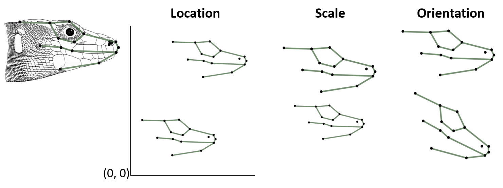  
```

# Scale and Size
- Position and orientation are due to digitizing procedures, and are not biologically relevant for most applications
- **Scale** includes the combined effects of focal distance during digitizing and “real” size variation
- Digitizing scale is calibrated during data acquisition
- **Size** is of biological interest. So, we standardize for it to obtain shape variables, but record it for subsequent analyses

<div style="text-align: center;">
```{r, echo = FALSE, out.width="30%"}
  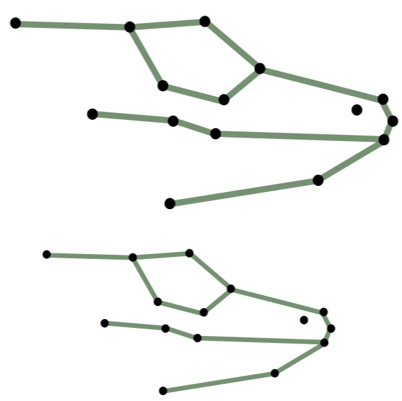  
```
</div>

###### Note: one can perform GM analyses without recording digitizing 'scale', but in this case one has no inherent size estimate, and no notion of its effect on shape

# Size in GM Studies
- Small objects: landmarks are closer together
- Large objects: landmarks are further apart
- So, in GM, size is associated to the dispersion of landmark coordinates

. . . 

**Centroid size**: the square root of the sum of the squared distances between each landmark and the centroid (center of mass of the object) of the landmark configuration:
$$\small{CS}=\sqrt{\sum_{i,j}^{k,p}\left(\mathbf{Y}_{ij}-\mathbf{Y}_{ic}\right)^2}$$

where $\small{p}$ is the number of landmarks and $\small{k}$ is the number of coordinate dimensions

<div style="text-align: center;">
```{r, echo = FALSE, out.width="20%"}
  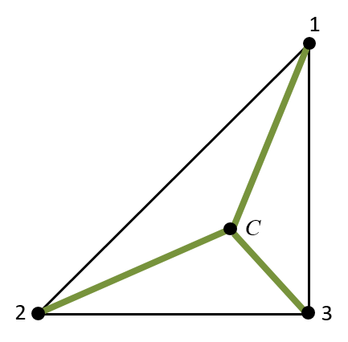  
```
</div>

# Centroid Size (CS): Properties
- One could use other size measures (a baseline, area, perimeter, …)
- BUT, centroid size has some useful properties
    - CS is **uncorrelated with shape** in the absence of allometry
    - As such, there is a **unique solution** for the quantification of “shape” (when standardizing size effects)
    - CS is an **unambiguous size measure**
    - Of different size measures proposed, CS is the only one that has this property

# Shape Differences
- No difference in shape: landmark coordinates completely coincident
- **Difference** in shape: difference in landmark coordinates
- This provides a measure of shape differences

```{r, echo = FALSE, out.width="100%"}
  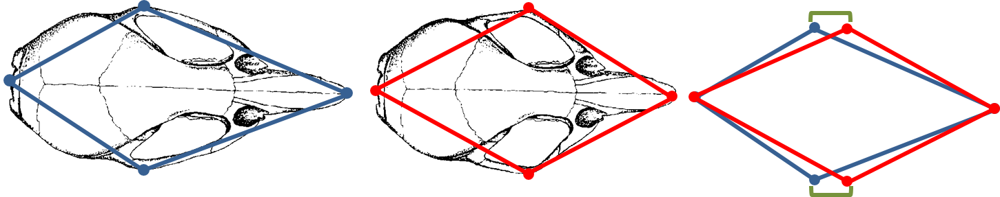  
```

. . . 

- **Procrustes distance**: the square root of the sum of squared deviations of landmark locations between two objects
$$\small{D}_{Proc}=\sqrt{\sum_{i,j}^{k,p}\left(\mathbf{Y}_{1.ij}-\mathbf{Y}_{2.ij}\right)^2}$$

# Shape from Landmarks
- To obtain shape variables, we first need to standardize position, scale and orientation: superimposition
- Several approaches have been proposed (see further on)
- The most robust for most situations, and the main tool of morphometrics is:

. . . 

- *Least-squares superimposition* aka **Procrustes Superimposition**
<div style="position: absolute; bottom: 20px; right: 200px;">
```{r, echo = FALSE, out.width="120%"}
  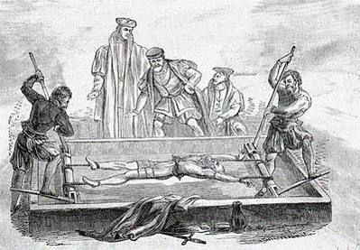  
```
</div>

. . . 

- Method
    - Translate centroid to origin
    - Scale to unit CS
    - Optimally rotate  
$\small\mathbf{Z}=\frac{1}{CS}\mathbf{(Y-\overline{Y})H}$

# Procrustes Superimposition: Translation
- Translate object to origin (mean centering)
<video width="640" height="480" controls="controls">
  <source  src="LectureData/02.Superimposition/Trans.mp4"></source>
</video>

# Procrustes Superimposition: Scale
```{r, echo = FALSE, out.width="80%"}
  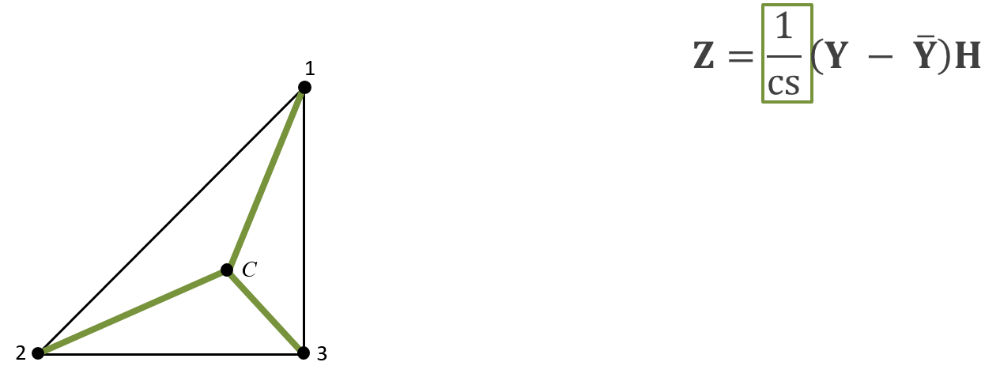  
```

- Scale object to $\small{CS}=1$

$$\small{CS}=\sqrt{\sum_{i,j}^{k,p}\left(\mathbf{Y}_{ij}-\mathbf{Y}_{ic}\right)^2}=$$

$$\small{[tr}[\mathbf{(Y-\overline{Y})(Y-\overline{Y})^T}]]^{-1/2}=1$$


# Procrustes Superimposition: Rotation
- Optimally align $\small\mathbf{Y}_2$ to  $\small\mathbf{Y}_1$  via rigid rotation ('optimally' in the least squares sense)

<video width="640" height="480" controls="controls">
  <source  src="LectureData/02.Superimposition/Rot.mp4"></source>
</video>

# How Much to Rotate?
$\small\mathbf{Z}=\frac{1}{CS}\mathbf{(Y-\overline{Y})H}$

- In Procrustes, rotation accomplished by rigid rotation using as: $\small\mathbf{H}=\begin{bmatrix} 
    \cos\theta       & \sin\theta \\
    -\sin\theta       & \cos\theta
\end{bmatrix}$

- How to find the angle $\small\theta$?
    - Conceptually: optimal fit of landmarks between configurations
    - Mathematically: use least-squares to find $\small\theta$

# Ordinary Procrustes Analysis: Review
$\small\mathbf{Z}=\frac{1}{CS}\mathbf{(Y-\overline{Y})H}$

```{r, echo = FALSE, out.width="60%"}
  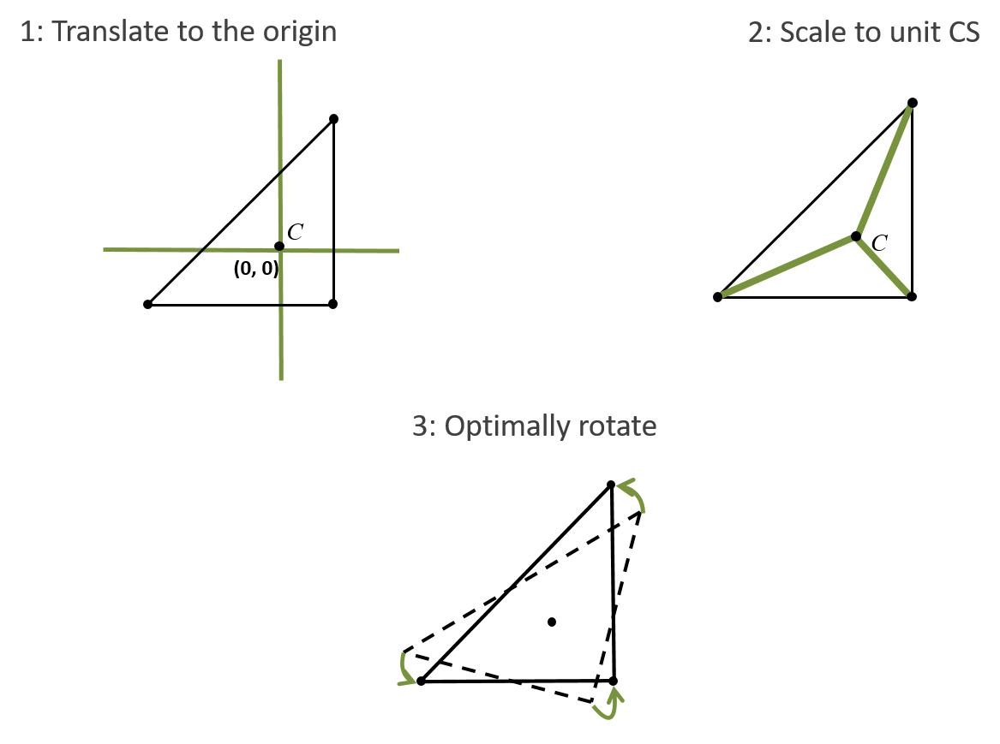  
```

- With OPA
    - $\small\mathbf{Z}$ are Procrustes residuals (aligned shape)
    - Universal solution for size: CS  (does not depend on choice of a baseline)
    - CS is uncorrelated with shape when no allometry is present
    - Optimal rotation, distributing the displacement among all landmarks
    - **BUT**, OPA is for $\small{n=2}$ objects only

# Generalized Procrustes Analysis
- Perform OPA in iterative fashion
- Steps
    - 1: Using the $\small{1}^{st}$ object as the reference
    - 2: Obtain OPA alignment for all other objects
    - 3: Calculate the consensus (mean) configuration ($\small\mathbf{\overline{Y}}$ )
    - 4: Estimate the total variation in the data ($\small{TSS}$)
    - 5: Repeat steps 2 - 4, using  $\small\mathbf{\overline{Y}}$   as the reference until convergence of $\small{TSS}$ (which will reduce each time)
    
. . . 

```{r, echo = FALSE, out.width="60%"}
  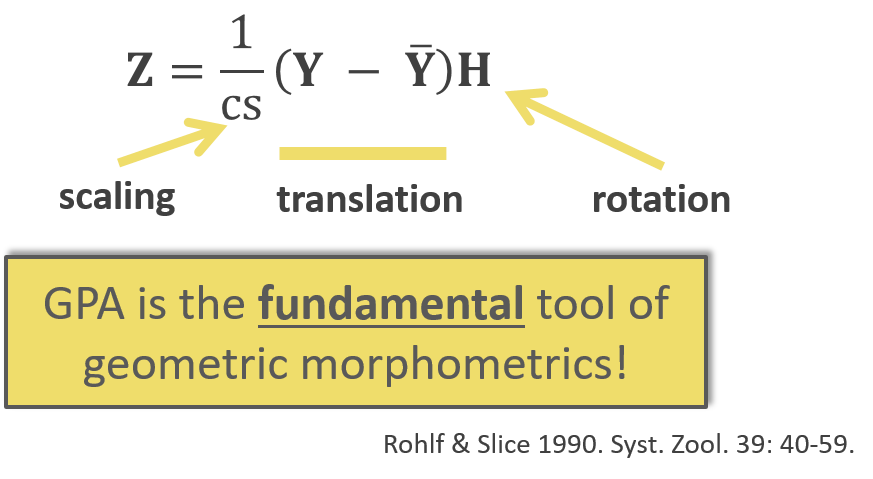  
```

# GPA: Example
- Sexual dimorphism in head shape of *Podarcis* wall lizards
- 12 lateral 2D landmarks
- Males and females
- MANOVA to test for shape differences
- PCA to visualize shape space

```{r, echo = FALSE, out.width="60%"}
  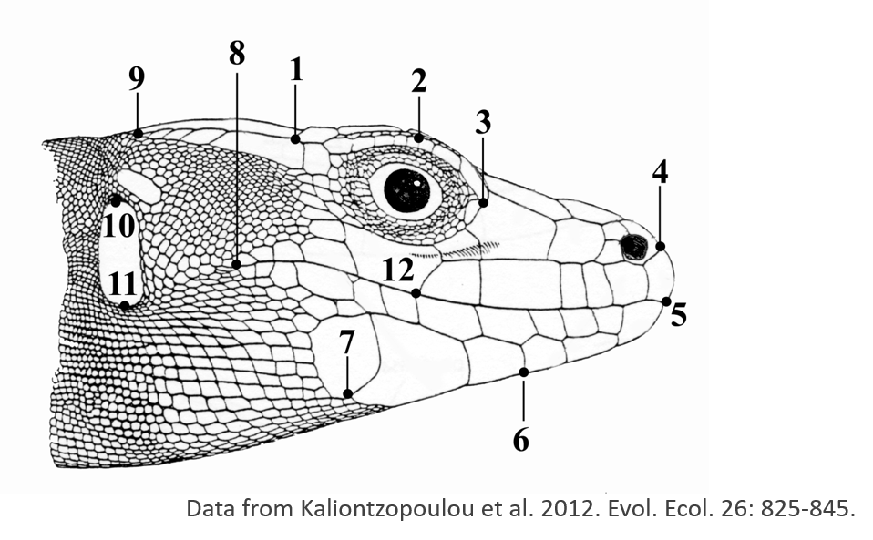  
```

# GPA: Example (Cont.)
- GPA-aligned specimens

```{r echo=FALSE, eval=TRUE}
lizards <- readland.nts('LectureData/04.shape.vars/lizards_LAT.nts')
links <- read.csv('LectureData/04.shape.vars/links.txt', header=FALSE, sep = " ")
liz.lab <- read.csv('LectureData/04.shape.vars/liz_groups.csv',header=TRUE, sep="\t")
col.gp <- rep("red",nrow(liz.lab))
col.gp[which(liz.lab$SEX=='M')] <- 'blue'

Y.gpa <- gpagen(lizards, print.progress = FALSE)
gdf <- geomorph.data.frame(Y.gpa, gp = col.gp)
plotAllSpecimens(Y.gpa$coords, links=links)
```

# GPA: Step By Step

```{r echo=FALSE, eval=TRUE}
source('LectureData/plot.specimens/plot.Specimens.r')
n <- dim(lizards)[1];p <- dim(lizards)[2]
Yc <- simplify2array(lapply(1:dim(lizards)[3], function(j) geomorph:::fast.center(lizards[,,j],n,p)))
Yc.rot <- simplify2array(lapply(1:dim(lizards)[3], function(j)  Y.gpa$coords[,,j]*Y.gpa$Csize[[j]]))
par(mfrow=c(2,2)) 
x <- plot.specimens(lizards, links = links, col=gdf$gp)
mtext("Original Specimens")
x <- plot.specimens(Yc,links = links, col=gdf$gp)
mtext("Translated Specimens")
x <- plot.specimens(Yc.rot,links = links, col=gdf$gp)
mtext("Translated and Scaled Specimens")
x <- plot.specimens(Y.gpa$coords, links=links, col=gdf$gp)
mtext("GPA-Aligned Specimens")
par(mfrow=c(1,1)) 
```

# GPA: Group Differences
- Males and females differ in shape:
```{r echo=FALSE, out.width="40%" }
res <- procD.lm(Y.gpa$coords ~ gp, data = gdf, print.progress = FALSE)
res$aov.table
```

```{r echo=FALSE, out.width="40%"}
male <- mshape(Y.gpa$coords[,,which(liz.lab$SEX=='M')])
female <- mshape(Y.gpa$coords[,,which(liz.lab$SEX=='F')])
ref <- mshape(Y.gpa$coords)
plotRefToTarget(ref, male, links = links, mag = 10, 
                gridPars = gridPar(tar.link.col = "blue", tar.pt.bg = "blue"))
plotRefToTarget(ref, female, links = links, mag = 10, 
                gridPars = gridPar(tar.link.col = "red", tar.pt.bg = "red"))
```

###### TPS of male vs. female *Podarcis* (10x magnification)

# GPA: Exploring Shape Variation
- Principal components visualization

```{r echo=FALSE, out.width="60%" }
pca <- gm.prcomp(Y.gpa$coords)
plot(pca, pch = 21, bg = col.gp)
pca.r <- prcomp(two.d.array(Y.gpa$coords))
summary(pca.r)
```

. . . 

- Why 4 dimensions with zero variation??

# GPA: Data Dimensionality
- 2D data initially contain $\small{2p}$ variables: $\small{2}$ coordinates for $\small{p}$ landmarks
- GPA standardized $\small{4}$ dimensions:
    - Translation in X
    - Translation in Y
    - Scaling
    - Rotation
- Therefore, the shape space for GPA-aligned specimens has $\small{2p-4}$ dimensions for 2D data
- For 3D data, dimensionality is $\small{3p-7}$ (general form is: $\small{pk – k – k(k – 1)/2 – 1}$

. . . 

- Because these dimensions are redundant, standard parametric statistical hypothesis testing will not work (singular covariance matrix... means divide by zero)

#### NOTE: as we'll see later, use of permutation methods (RRPP) alleviates this issue.

# GPA: Extensions to Three Dimensions

- GPA works the same with 3D data (matrices simply have $\small{3}^{rd}$ column)

<div style="position: absolute; bottom: 250px; right: 50px;">
```{r, echo = FALSE, out.width="150%"}
  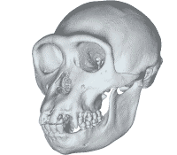  
```
</div>

Now we have: $\tiny{Y}=\begin{bmatrix} X_1 & Y_1 & Z_1 \\ 
X_2 & Y_2 & Z_2 \\
\vdots & \vdots & \vdots \\
X_p & Y_p & Z_p \\
\end{bmatrix}$   & $\small\mathbf{Z}=\frac{1}{CS}\mathbf{(Y-\overline{Y})H}$

. . . 

- Translation in $\small{x}$, $\small{y}$, and $\small{z}$, directions 
- Scale to $\small{CS=1}$
- Rotate in $\small{(XY)}$, $\small{(XZ)}$, and $\small{(YZ)}$ planes

. . . 

- GPA for 3D data standardizes $\small{7}$ dimensions

# Modifications: Full Vs. Partial Procrustes Fitting

- GPA is a regression of $\small\mathbf{Y}_i$ on $\small\mathbf{\overline{Y}}$ after centering and scaling ($\small{CS = 1}$)
    - Fitting can be improved by allowing size to vary
    - Full fitting: superimposition allowing $\small{CS}$ to vary
    - Partial fitting: superimposition after $\small{CS = 1}$

- NOTE: while mathematically elegant, Full Procrustes is NOT symmetrical 
(i.e. $\small{CS}$ from fitting $\small\mathbf{Y}_1$ on $\small\mathbf{Y}_2$ is not the same as $\small{CS}$ from fitting $\small\mathbf{Y}_2$ on $\small\mathbf{Y}_1$) 

- In practice, only partial fitting seems useful for empirical studies

# Historical Note: Bookstein's Shape Coordinates

- A straightforward approach to standardize position, orientation and size in landmark coordinates 
    - Position: location of landmark $\small{1}$
    - Orientation: location of landmark $\small{2}$
    - Size: distance between landmarks $\small{1}$ & $\small{2}$
    
. . . 

```{r, echo = FALSE, out.width="80%"}
  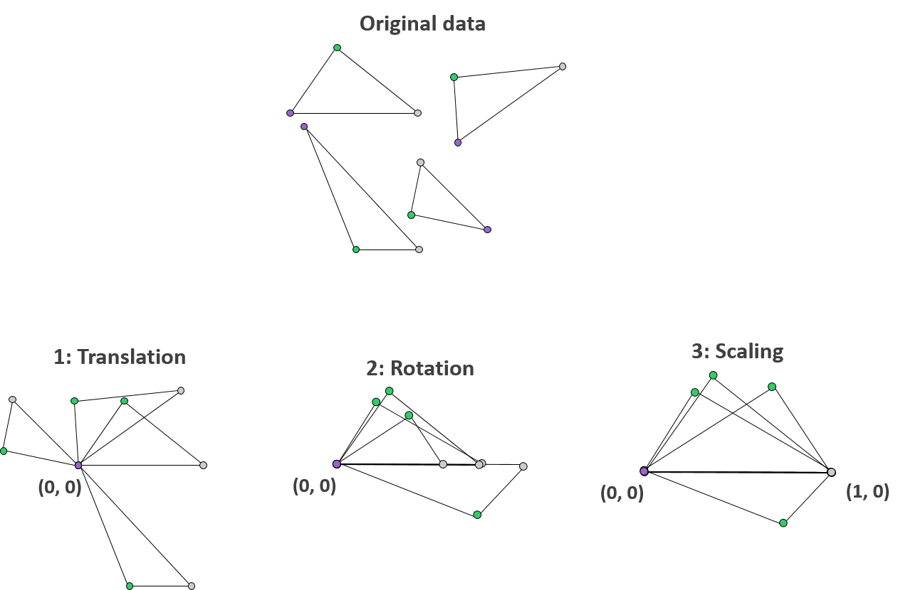  
```

# Bookstein's Shape Coordinates

- A straightforward approach to standardize position, orientation and size in landmark coordinates 
    - Position: location of landmark $\small{1}$
    - Orientation: location of landmark $\small{2}$
    - Size: distance between landmarks $\small{1}$ & $\small{2}$

\

- Very intuitive, however:
    - Selection of landmarks $\small{1}$ & $\small{2}$, which define the baseline, is arbitrary
    - Choice of baseline alters size and shape estimates
    - Short baselines cause instabilities in shape inference
    - Baseline length IS correlated to shape variables

\

>- Recommendation: choose long baseline

\

>- Conclusion: while intuitive and easy to understand, GPA is preferred

# Superimposition: Summary

- Raw landmark coordinates include non-shape information, which we need to account for in order to obtain shape variables
- This is done through superimposition, which removes the effects of location, size and orientation in the data
- **GPA is the preferred method**: intuitive criterion for optimization (LS); statistically robust; well known properties of resulting shape space

- Superimposition (plus projection) creates the shape space where statistical hypotheses are tested
- Because of standardization (location , size, rotation), the resulting shape space has fewer dimensions than the raw data:
    - $\small{2p-4}$ for 2D data
    - $\small{3p-7}$ for 3D data

# Shape Spaces from GPA

- After GPA, each landmark configuration is a point in shape space
- The 'center' of this universe is the consensus (global mean shape)
- Each shape occupies a unique point in shape space
- The metric of shape space is the Procrustes distance $\small{D}_{Proc}$

$$\tiny{D}_{Proc}=\sqrt{\sum_{i,j}^{k,p}\left(\mathbf{Y}_{1.ij}-\mathbf{Y}_{2.ij}\right)^2}$$

- **Shape space is curved!** 

<div style="text-align: center;">
```{r echo=FALSE, eval=TRUE, out.width="50%"}
n=2000
p=3
k=2
tri<- arrayspecs(matrix(runif(n*p*k),nrow=n),p=p,k=k)
tri.gpa <- gpagen(tri,Proj = FALSE, print.progress = FALSE)
pc.tri <- prcomp(two.d.array(tri.gpa$coords))$x
mult.pc <- ifelse(which.min(abs(range(pc.tri[,3])))==1,-1,1) #make'up-facing'

plot <- scatterplot3d(pc.tri[,1],pc.tri[,2],mult.pc*pc.tri[,3], asp=1, pch=21, bg="red", tick.marks = FALSE, box=FALSE)
```
<p style="font-size: 0.7em; color: gray;">
    Example with 2,000 random (uniform) triangles. Note overabundance of shapes near 'north pole'.
  </p>
</div>

# Tangent Space

- Statistics in curved spaces become tricky
- Solution: project to a linear space *tangent* to shape space (tangent at the consensus [mean], to minimize distortion)

```{r, echo = FALSE, out.width="50%"}
  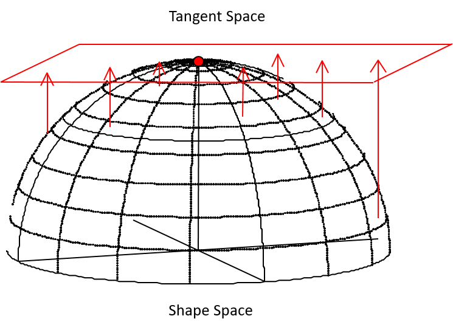  
```

# Tangent Space

- Statistics in curved spaces become tricky
- Solution: project to a linear space *tangent* to shape space (tangent at the consensus [mean], to minimize distortion)

```{r, echo = FALSE, out.width="50%"}
    
```

- How? 
    - Orthogonal Projection (via Burnaby's equation)
    - Thin-plate spline

- Methods turn out to be identical (next lecture)
