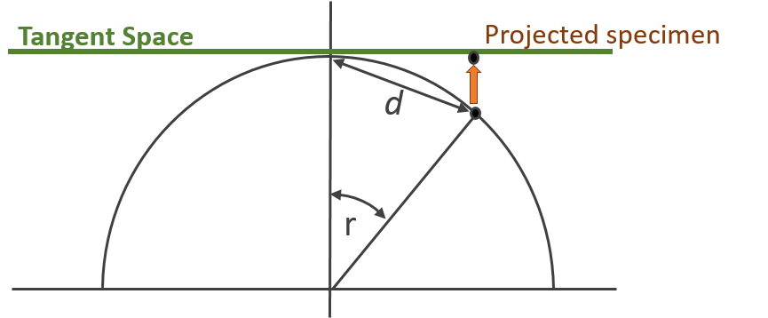
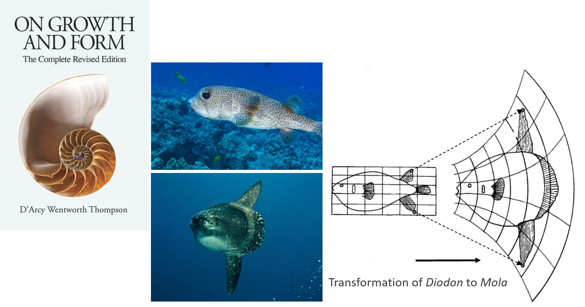
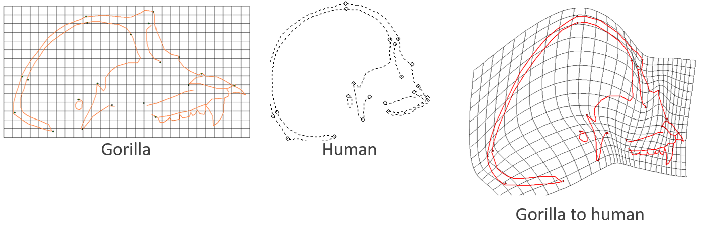
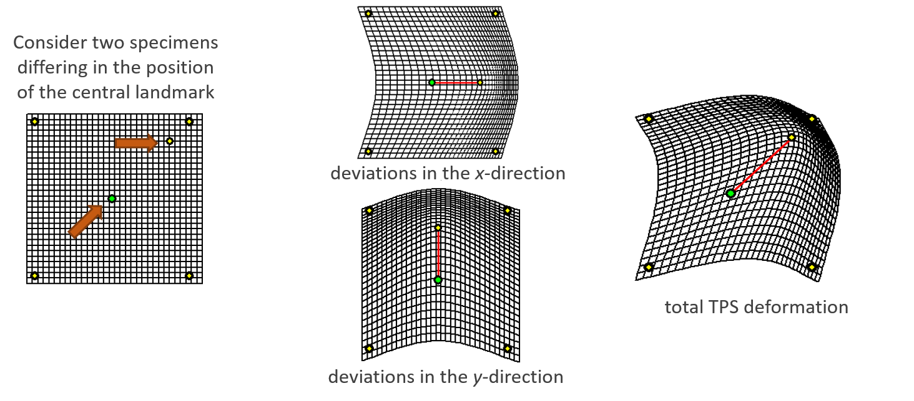
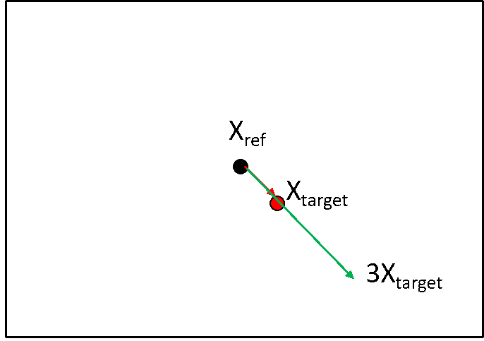

# From GPA to Shape Data
<style>
.slide h1 {
  margin-top: 15px !important;
}

/* This creates the fade-in animation */
@keyframes fadeIn {
  from { opacity: 0; }
  to   { opacity: 1; }
}

/* This applies it to every slide */
.slide {
  animation: fadeIn 0.8s ease-in-out;
}

/* Target the incremental list items */
.incremental > li, .incremental > p {
  animation: fadeIn 0.6s ease-in-out;
}

/* Remove extra indentation from the incremental container */
.incremental {
  margin-left: 0.2 !important;
  padding-left: 0.5 !important;
}

/* Ensure the list items themselves match your standard list style */
ul.incremental, ol.incremental {
  margin-left: 1.5em; /* Adjust this value to match your main theme */
}

/* This changes the body text */
body, div, p {
  font-family: Lucida Console, sans-serif;
}

/* This changes the headers */
h1, h2, h3 {
  font-family: Lucida Console, sans-serif;
  color: #6954b0;
}

</style>

```{r setup, include=FALSE, echo = TRUE, tidy = TRUE}
library(knitr)
library(geomorph)
library(scatterplot3d)
opts_chunk$set(echo = TRUE)
```

- In this lecture we:
    - Obtain variables we can use for analyses
    - Review the relative position of individuals in shape space
    - Visualize shape variation

```{r echo=FALSE, eval=TRUE, fig.align='center', out.height="40%"}
lizards <- readland.nts('LectureData/03.shape.vars/lizards_LAT.nts')
links <- read.csv('LectureData/03.shape.vars/links.txt', header=FALSE, sep = " ")
liz.lab <- read.csv('LectureData/03.shape.vars/liz_groups.csv',header=TRUE, sep="\t")
col.gp <- rep("red",nrow(liz.lab))
col.gp[which(liz.lab$SEX=='M')] <- 'blue'

Y.gpa <- gpagen(lizards, print.progress = FALSE)

par(mfrow=c(1,2)) 
plotAllSpecimens(lizards, links = links)
plotAllSpecimens(Y.gpa$coords, links=links)
par(mfrow=c(1,1)) 
```

# Shape Spaces from GPA

- After GPA, each landmark configuration is a point in shape space
- The 'center' of this universe is the consensus (global mean shape)
- Each shape occupies a unique point in shape space
- The metric of shape space is the Procrustes distance $\small{D}_{Proc}$

$$\tiny{D}_{Proc}=\sqrt{\sum_{i,j}^{k,p}\left(\mathbf{Y}_{1.ij}-\mathbf{Y}_{2.ij}\right)^2}$$

. . .

- **Shape space is curved!** 
<div style="text-align: center;">
```{r echo=FALSE, eval=TRUE, out.width="50%"}
n=2000
p=3
k=2
tri<- arrayspecs(matrix(runif(n*p*k),nrow=n),p=p,k=k)
tri.gpa <- gpagen(tri,Proj = FALSE, print.progress = FALSE)
pc.tri <- prcomp(two.d.array(tri.gpa$coords))$x
mult.pc <- ifelse(which.min(abs(range(pc.tri[,3])))==1,-1,1) #make'up-facing'

plot<-scatterplot3d(pc.tri[,1],pc.tri[,2],mult.pc*pc.tri[,3], asp=1, pch=21,bg="red", tick.marks = FALSE, box=FALSE)

```
<p style="font-size: 0.7em; color: gray;">
    Example with 2,000 random (uniform) triangles.   
    Note overabundance of shapes near 'north pole'.
  </p>
</div>

# Consequences of GPA

- With GPA, specimen location, scale and rotation are standardized, resulting in redundant dimensions
- $\small{2p-4}$ for 2D landmarks or $\small{3p-7}$ for 3D landmarks

- Statistical Challenges:
    - Covariance matrices are singular, so statistical hypothesis testing via parametric approaches cannot be completed
    - Shape space is curved, and most standard statistics assume linear spaces

. . . 

- Solutions:
    - Data projection to a tangent space. This provides both a linear approximation to shape space and allows for redudant dimensions to be removed
    - Use RRPP (residual randomization in permutation procedures) for evaluating statistical hypotheses (subsequent lectures)

# Kendall's Tangent Space Coordinates

- Orthogonal projection of shapes to linear tangent space

$$\small\mathbf{X}'=\mathbf{X\left(I_{kp}-X_c^T(X_cX_c^T)^{-1}X_c\right)}$$

```{r, echo = FALSE, out.width="50%"}
  
```

>- Specimen scores from projection are Kendall’s tangent space coordinates (Dryden and Mardia, 1993; Kent 1994)
>- Perform PCA and retain only 2p-4 (3D: 3p-7) shape variables with variation if desired (**NOTE: permutation via RRPP is now standard practice, so this step is not strictly necessary!**)

# Kendall's Tangent Space Coordinates

- Random uniform shapes *ARE* uniformally distributed in Tangent Space!

```{r echo=FALSE, eval=TRUE,out.width="80%"}
plot(pc.tri[,1:2], asp=1, pch=21, bg="red")

```

##### Same set of 2,000 randomly generated triangles

# Shape Differences as Deformations

- With Tangent Space we can view patterns of shape variation; what about visualzing individual shape differences? 
- D'Arcy Thompson, in "On Growth and Form" (1917) visualized shape differences using transformation grids  
- Simple mathematical models to represent complex morphological changes 

```{r, echo = FALSE, out.width="80%"}
  
```

>- Today we use the *Thin-Plate Spline* to generate such visualizations

# Shape Deformations: the Thin-Plate Spline

- Based on D'Arcy Thompson's, Bookstein (1989) proposed using the thin-plate spline for providing a mathematically accurate representation of shape change (math was borrowed from engineering methods from 1980s)
- Deformation of a *reference* to a *target* specimen
- The coefficients of the fitted TPS model describe shape changes

```{r, echo = FALSE, out.width="80%"}
  
```

>- The TPS is an alternative way of projecting aligned shape coordinates to tangent space (different math, but same result)

# The Thin-Plate Spline

- TPS is a smooth interpolation function (i.e., a doubly-differentiated equation)
- It models the differences in landmark locations between the reference and target specimen for each coordinate dimension separately (x,y)

```{r, echo = FALSE, out.width="70%"}
  
```

>- This model provides $\small{2p-4}$ shape variables for 2D data and $\small{3p-7}$ for 3D data
>- These are known as the *partial warp scores* and the *uniform component* (details ommited, but these are different types of potential shape transformations)

# Which Shape Variables to Use?

- We then have 3 shape variable options: 
    - GPA-aligned coordinates
    - Kendall's Tangent Space coordinates (GPA + orthogonal projection)
    - TPS variables (partial warp scores + uniform shape) 
- Which ones should we use?

. . . 

<div style="text-align: center;">
```{r echo=FALSE, eval=TRUE,out.width="40%"}
Y.gpa2 <- gpagen(lizards, Proj = FALSE, print.progress = FALSE)
Kendall.d <- dist(two.d.array(Y.gpa$coords))
GPA.d <- dist(two.d.array(Y.gpa2$coords))

plot(GPA.d,Kendall.d)
```
<p style="font-size: 0.7em; color: gray;">
    Plot of shape distances for *Podarcis* data obtained from GPA-shape space and Kendall's Tangent space.  
    Correlation of 1.0 in this case (usually very, very high).
  </p>
</div>

>- **AND** correlation between PWS+U vs. Tangent space is **ALWAYS** 1.0 (see Rohlf 1999)

# Shape Variables: Conclusions

- Kendall's Tangent coordinates & TPS shape variables yield identical results
    - They are simply rotations of one another
- GPA-aligned coordinates (unprojected) are close, but not exact 
    - Difference due to curvature of shape space

>- **Use Kendall´s Tangent Space Coordinates** to represent shape
>- These are found from GPA+Orthogonal Projection

>- NOTE: Most current papers use tangent space coordinates, aka Procrustes residuals combined with resampling tests (to accomodate singular dimensions) 
>- TPS then, is frequently used to **visualize shape differences**

# Exploring Shape Variation

- GM data are points in high-dimensional shape space
    - (e.g. for $\small{p=20}$ & $\small{k=3}$, shape space comprises 53 dimensions)
- Our human brains are limited to perception in up to 3 dimensions
- We need tools for visualizing and exploring shape variation in high-dimensional data spaces

>- Principal Components Analysis (PCA) is one such tool

# Principal Components Analysis (PCA)

- PCA combines orthogonal rotation and projection to arrive at a summary plot of the data space 
- The objective: to summarize most of the variation in as few dimensions as possible
- It consists of a rigid rotation of the data based on directions of variation, followed by projection to those new summary axes
- First one finds the set of axes the describe progressively less variation in the data
- Next, the data are rotated so that the main axis of variation (PC1) is horizontal
- Subsequent axes are orthogonal to PC1

# PCA: Conceptual Visualization

- This is what PCA does:

```{r echo=FALSE, out.width="80%" }
bumpus <- read.csv("LectureData/03.shape.vars/bumpus.csv",header=T)
Y.2 <- cbind(bumpus$TL,bumpus$AE)
par(mfcol = c(1, 2))
plot(Y.2, pch=21, bg="red", xlab="Total Length", ylab="Alar Extent")
```

# PCA: Conceptual Visualization

- This is what PCA does:

```{r echo=FALSE, out.width="80%" }
Y.pc <- prcomp(Y.2)$x
par(mfcol = c(1, 2))
plot(Y.2, pch=21, bg="red", xlab="Total Length", ylab="Alar Extent")
plot(Y.pc, asp=1,pch=21, bg="red", xlab="PC1", ylab="PC2")
```

- PCA has performed a rigid rotation of the original data, so that variation is aligned with the new (PC) axes

# PCA: Standard Computations

Principal component analysis (PCA) is two things: (1) a singular-value decomposition (SVD) of a symmetric matrix and (2) projection of mean-centered or standardized data onto eigenvectors from SVD. 

Using mean-centered data: $\small\mathbf{Y}_c$ we calculate:

$$\small\hat{\mathbf{\Sigma}}=\frac{\mathbf{Y}^{T}_c\mathbf{Y}_c}{n-1}$$

We then decompose the covariance matrix via eigen-analysis (SVD):

$$\small\hat{\mathbf{\Sigma}}=\mathbf{U} \mathbf{\Lambda} \mathbf{U}^T$$

This step identifies a set of orthogonal axes describing directions of variation. These are the columns of $\small\mathbf{U}$. Next we project the data onto these axes as: 

$$\small\mathbf{P} = \mathbf{Y}_c\mathbf{U}$$

Here, $\small\mathbf{P}$ represent the set of projection scores (principal component scores) on each of the PC axes. These are used in the subsequent plot.

Finally, the percent variation explained by any principal component (column of $\mathbf{U}$) is 
$$\frac{\lambda_i}{tr\mathbf{\Lambda}}$$

# PCA: Alternative Computations

Note that one can alternatively perform singular-value decomposition (SVD) directly on $\small\mathbf{Y}_c$: 

$$\small{\mathbf{Y}_c}=\mathbf{V} \mathbf{D} \mathbf{U}^T$$

Here, $\small\mathbf{D^2}$ expresses the percent-variation explained by each PC-axis, which are found as the right-singular vectors in $\small\mathbf{U}$.

PC scores are found as: 

$$\small\mathbf{P} = \mathbf{VD}$$

###### NOTE: eigenanalysis of the *inner product* $\small\mathbf{Y}^{T}_c\mathbf{Y}_c$ yields $\small\mathbf{U}$, while eigenanalysis of the *outer product* $\small\mathbf{Y}_c\mathbf{Y}^{T}_c$ yields $\small\mathbf{V}$


# Visualizing Shape Differences

- TPS allows us to visualize what exactly changes in shape
- As an interpolation function, TPS allows us to precisely map all points of one shape to those of another shape, and visualize how they differ

- One may wish to visualize:
    - Differences between groups
    - Extremes of PC axes
    - How shape changes with size (allometry)
    - Shape evolution (differences between ancestor and descendent on a phylogeny)

. . . 

- One can also magnify shape differences to aid biological interpretation 

```{r, echo = FALSE, out.width="40%"}
  
```

###### *TPS of Ref->Target is a vector in shape space, which can be extended in length

# Visualizing Shape Differences: Example

<center> **TPS of male vs. female *Podarcis* (5X magnification)** </center>

<div class="column-left" style="width: 50%; float: left;">
```{r echo=FALSE, out.width="100%" }
male <- mshape(Y.gpa$coords[,,which(liz.lab$SEX=='M')])
female <- mshape(Y.gpa$coords[,,which(liz.lab$SEX=='F')])

plotRefToTarget(male, female, links = links, mag = 5)
```
</div>

<div class="column-left" style="width: 50%; float: right;">
```{r echo=FALSE, out.width="100%" }
plotRefToTarget(female, male, links = links, mag = 5)
```
</div>

- Major difference in posterior region of skull

# Shape Variables: Conclusions

- Produce shape variables through projection to tangent space:
    - **Kendall´s tangent space coordinates (Procrustes residuals [GPA+Projection])**

\

- Explore shape variation through ordination in tangent space:
    - **PCA of shape data (aka Relative Warps)**

\

- Visualize shape variation to make biological interpretations:
    - **Use TPS to produce deformation grids**
