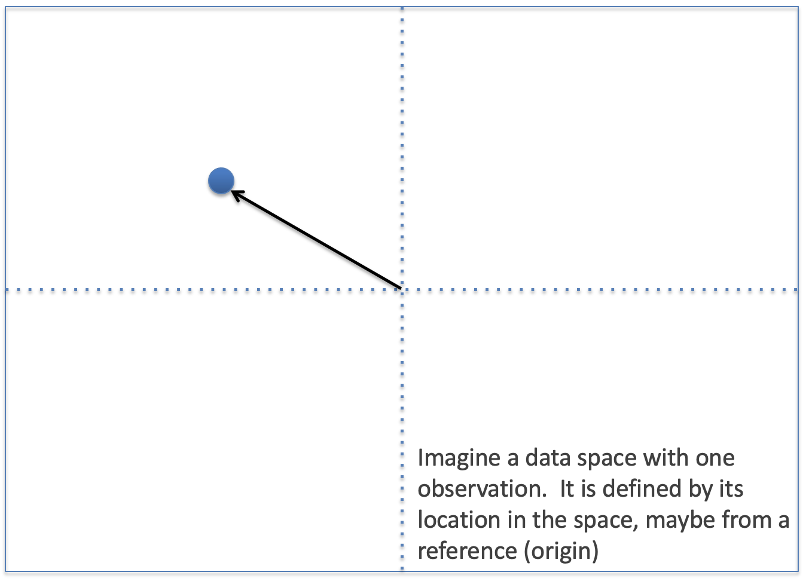
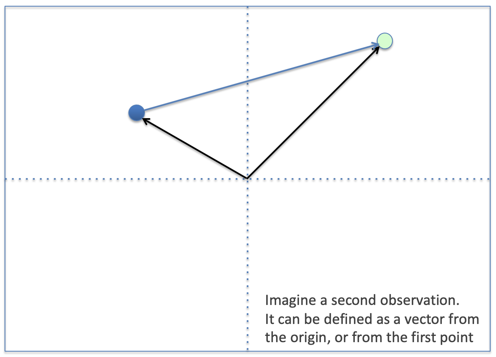
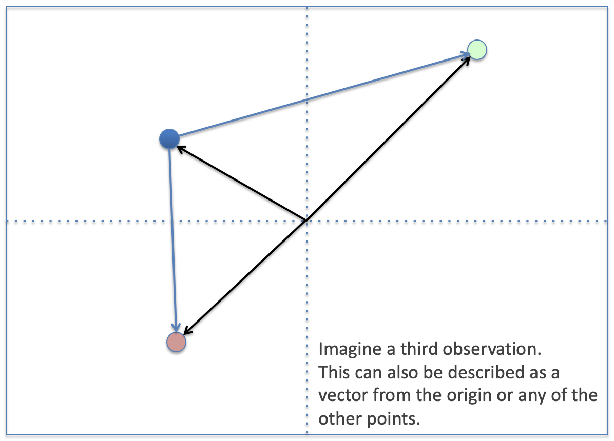
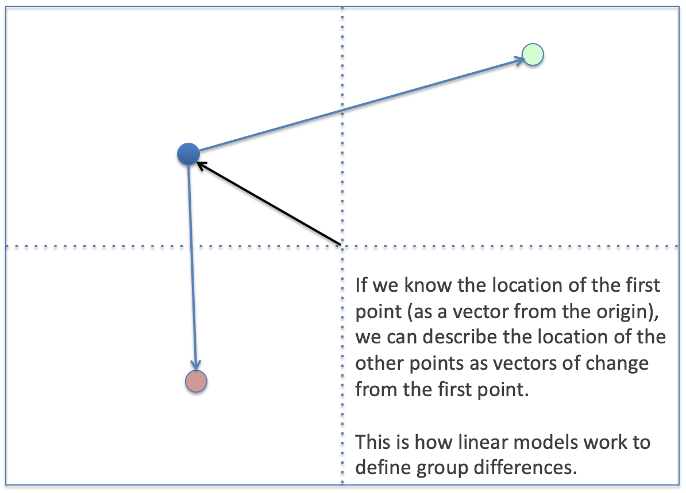
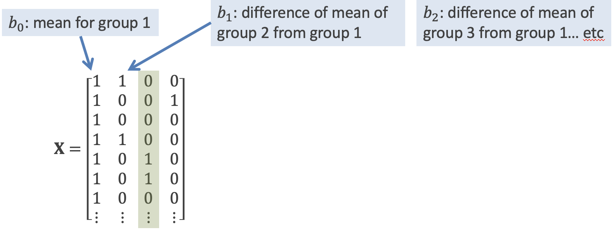
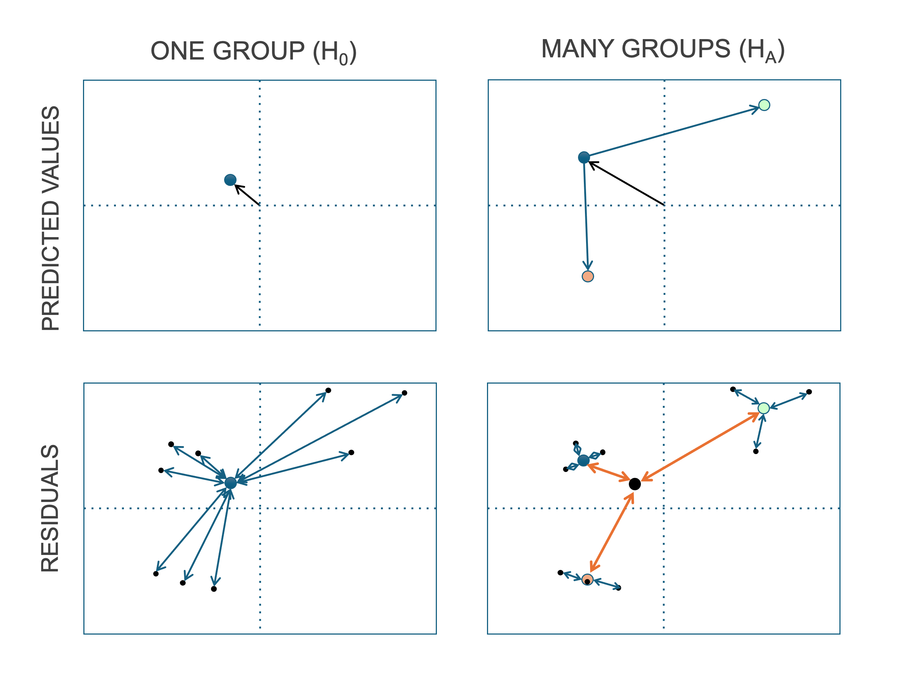
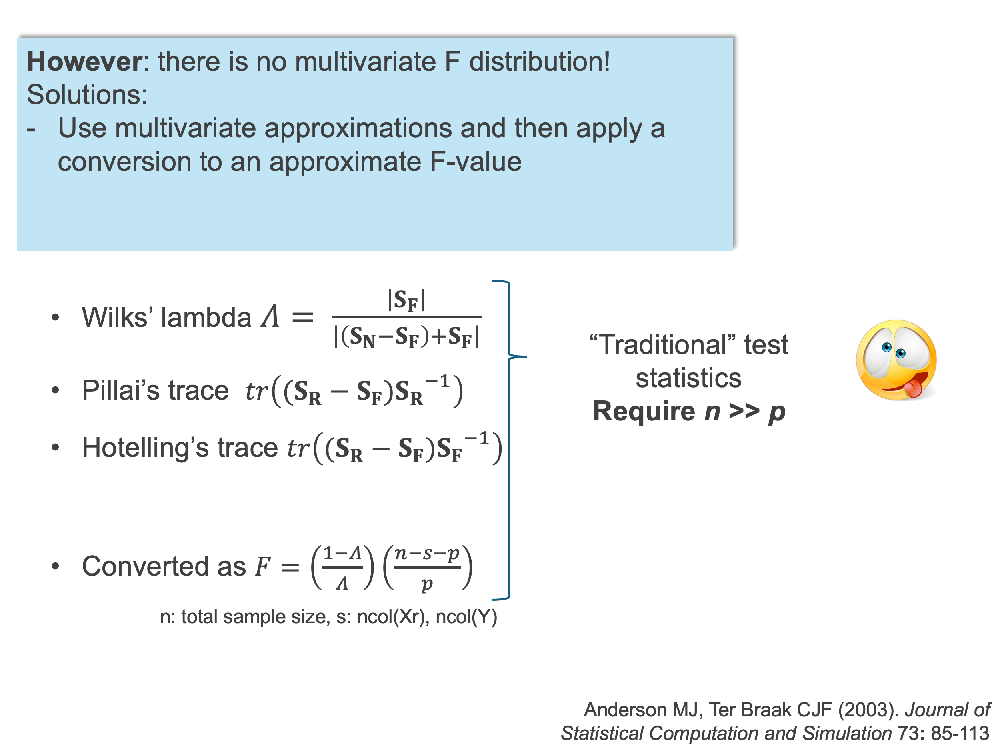
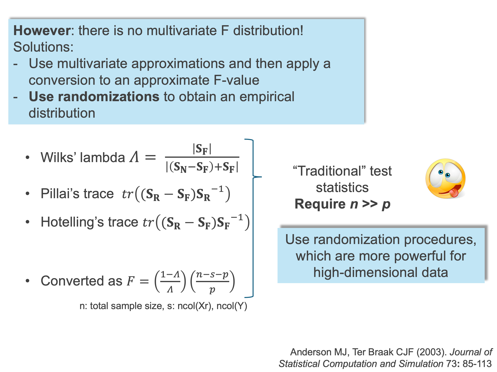

# Overview:
<style>
.slide h1 {
  margin-top: 15px !important;
}

/* This creates the fade-in animation */
@keyframes fadeIn {
  from { opacity: 0; }
  to   { opacity: 1; }
}

/* This applies it to every slide */
.slide {
  animation: fadeIn 0.8s ease-in-out;
}

/* Target the incremental list items */
.incremental > li, .incremental > p {
  animation: fadeIn 0.6s ease-in-out;
}

/* Remove extra indentation from the incremental container */
.incremental {
  margin-left: 0.2 !important;
  padding-left: 0.5 !important;
}

/* Ensure the list items themselves match your standard list style */
ul.incremental, ol.incremental {
  margin-left: 1.5em; /* Adjust this value to match your main theme */
}

/* This changes the body text */
body, div, p {
  font-family: Lucida Console, sans-serif;
}

/* This changes the headers */
h1, h2, h3 {
  font-family: Lucida Console, sans-serif;
  color: #6954b0;
}

</style>

```{r setup, include=FALSE, echo = TRUE, tidy = TRUE}
library(knitr)
library(RRPP)
library(geomorph)
opts_chunk$set(echo = TRUE)
```

- Types of GLMs
- GLMs in matrix format

\

- Design matrices for groups
- Testing for group differences
- One-way MANOVA
- Randomized residual permutation procedure (RRPP)
- Factorial MANOVA
- Post-hoc comparisons

# Thoughts on model names
```{r, echo = FALSE, out.width="80%", fig.align='center'}
include_graphics("LectureData/04.groupdifferences/GLM_names.png")  
```

# Thoughts on nomenclature
```{r, echo = FALSE, fig.align='center', out.width="75%"}
include_graphics("LectureData/04.groupdifferences/GLM_nomenclature.png")  
```

# The General Linear Model
```{r, echo = FALSE, fig.align='center', out.width="75%"}
include_graphics("LectureData/04.groupdifferences/GLM_structure.png")  
```

>- The goal is to find a solution for which the estimated value of a data vector, given a vector of predictors, is expected to be true.

# GLM types
```{r, echo = FALSE, fig.align='center', out.width="70%"}
include_graphics("LectureData/04.groupdifferences/GLM_types.png")  
```

# More on nomenclature
```{r, echo = FALSE, fig.align='center', out.width="100%"}
include_graphics("LectureData/04.groupdifferences/GLM_nomenclature2.png")  
```

>- **Multivariate** refers to the response variable(s) $\mathbf{Y}$
>- Sometimes the term *“multiple”* is used to denote > 1 explanatory variables $\mathbf{X}$

# The GLM matrices
$$
\begin{aligned}
Y = \beta_0 + \beta_1X_1 + \beta_2X_2 + \dots +  \beta_nX_n + \epsilon  
\end{aligned}
$$
$$
\begin{aligned}
\mathbf{Y = X\bf\unicode[Times]{x3B2} + E}
\end{aligned}
$$

- They are **all the same model!**  
- Only difference: data in $\mathbf{X}$  
- Works equally for univariate and multivariate $\mathbf{Y}$  

# The GLM matrices (Cont.)
- Dependent variables 
$$
\mathbf{Y =
\begin{bmatrix}
Y_{11} & Y_{12} & \cdots & Y_{1p} \\
Y_{21} & Y_{22} & \cdots & Y_{2p} \\
\vdots & \vdots & \ddots & \vdots \\
Y_{n1} & Y_{n2} & \cdots & Y_{np}
\end{bmatrix}
}
$$

>- Independent (predictor) variables
$$
\mathbf{X =
\begin{bmatrix}
1 & X_{11} &  \cdots & X_{1k} \\
1 & \vdots & \ddots & \vdots \\
1 & X_{n1} & \cdots & X_{nk}
\end{bmatrix}
}
$$
>- Solve for coefficients 
$$
\bf\unicode[Times]{x3B2} =
\begin{bmatrix}
\beta_{0} \\
\vdots \\
\beta_{p}
\end{bmatrix}
$$
found as $$ \bf\unicode[Times]{x3B2} = (X^TX)^{-1}(X^TY) $$

# GLM - estimation
$$ \bf\unicode[Times]{x3B2} = (X^TX)^{-1}(X^TY) $$

- This expresses **ALL types of General Linear Models!** 
- It is modified by including different types of data in $\mathbf{X}$
- $\mathbf{X}$ may include categorical variables (factors), continuous predictors (covariates), combinations of the two, and interactions between them

\

>- Solving $\bf\unicode[Times]{x3B2}$ this way minimizes the sum of squared residuals (error) and it is usually referred to as “*Least-Squares*” (LS) estimation
>- In other words, coefficients estimated from the model design, $\mathbf{X}$, will minimize the sum squared error between observed data and expected values 
>- As such, the error is an indication of how good the *fit of the model* is

# ANOVA, groups and the design matrix
- **AN**alysis **O**f **VA**riance: the procedure of evaluating any GLM by testing whether the inclusion of a term in a model causes a **change in residual variance**

. . . 

- More loosely (and generally) used to describe a GLM where X is a grouping factor
- Same model $$ \bf{Y} = X \unicode[Times]{x3B2} $$ same estimators $$ \bf\unicode[Times]{x3B2} = (X^TX)^{-1}(X^TY) $$

. . . 

- $\mathbf{X}$ describes *group membership*, and this is recoded into g-1 **dummy variables**
```{r, echo = FALSE}
Xtab <- matrix(c("A", "A", "B", "B", 0, 0, 1, 1), nrow = 4, byrow = F)
knitr::kable(Xtab, col.names = c("GROUP", "X1"),
             table.attr = "style='position: absolute; top: 50%; left: 50%; transform: translate(-50%, -50%);'")
```

# Data as points in multivariate space
```{r, echo = FALSE, fig.align='center', out.width="75%"}
  
```

# Data as points in multivariate space
```{r, echo = FALSE, fig.align='center', out.width="75%"}
  
```

# Data as points in multivariate space
```{r, echo = FALSE, fig.align='center', out.width="75%"}
  
```

# Data as points in multivariate space
```{r, echo = FALSE, fig.align='center', out.width="75%"}
  
```

# Group differences in GLMs
- Dummy variables work like switches: 
0 turns the light off; 1 turns the light on

\

```{r, echo = FALSE, fig.align='center', out.width="80%"}
  
```

# ANOVA: the meaning of $\bf\unicode[Times]{x3B2}$
- In ANOVA designs, the estimated parameters represent the mean of the first group and the difference of the means of other groups from it

. . . 

- For instance, for group 3:

$$\widehat{y} = \beta_{0} + \beta_{1}x_{1} + \beta_{2}x_{2} + \beta_{3}x_{3}$$
$$\widehat{y} = \beta_{0} + \beta_{1}0 + \beta_{2}1 + \beta_{3}0$$
$$\widehat{y} = \beta_{0} + \beta_{2}$$

- The mean (predicted value) for group 3 is the mean of group 1 ($\beta_0$) plus the adjustment for group 3 ($\beta_2$)

# Group differences: an example
```{r, echo = FALSE, out.width="90%"}
include_graphics("LectureData/04.groupdifferences/pupfish.example.png")  
```

# How Design Matrices Model Responses for Different Groups
Developing an intuition for how design matrices are constructed helps us better understand the analytical methods we are using.

There are different ways to construct model design matrices.    
We will use the most traditional way, which is how **R** works.

```{r echo = TRUE, include = TRUE}
library(geomorph)
data("pupfish")
# Make a new data frame with only 8 fish (subjects 15-18, 40-43)
select <- c(15:18, 40:43)
df <- data.frame(logSize = log(Pupfish$CS),
                 Sex = Pupfish$Sex, 
                 Pop = Pupfish$Pop,
                 Group = interaction(Pupfish$Sex, Pupfish$Pop))
df <- data.frame(df[select, ])
```

# Design Matrices: Factors
Factors (categorical variables) require multiple variables for the various levels of the factor.

```{r echo = TRUE, include = TRUE}
df$Group
model.matrix(~ Group, data = df)
```

# Design Matrices: Factors (cont.)
Factors (categorical variables) require multiple variables for the various levels of the factor.

```{r echo = TRUE, include = TRUE}
model.matrix(~ Group, data = df)
model.matrix(~1, data = df)
```

# Design Matrices: Factors (cont.)
Means can be described as vectors from the origin or from a first mean.  
Let's see how this works with the **R** example

```{r echo = TRUE, include = TRUE}
X0 <- model.matrix(~ 1, data = df)
y <- df$logSize
B0 <- solve(crossprod(X0)) %*% crossprod(X0, y) # find the overall mean of y
B0 # the overall mean
mean(y)
```

# Design Matrices: Factors (cont.)
```{r echo = TRUE, include = TRUE}
Xg <- model.matrix(~ Group + 1, data = df) 
Bg <- solve(crossprod(Xg)) %*% crossprod(Xg, y) # find group means 
Bg
by(y, df$Group, mean)
```

. . . 

#### Wait!  These values are different!
*Remember that fitted values are found as $\mathbf{\hat{Y}} = \mathbf{X\hat{\beta}}$ !!!*

# Geometric Interpretation of Model Effects (summary)
```{r, echo = FALSE, fig.align='center', out.width="70%"}
  
```

# Is one model better than the other?
```{r, echo = FALSE, fig.align='center', out.width="70%"}
include_graphics("LectureData/04.groupdifferences/stats/Slide6.png")  
```

# Is one model better than the other? (cont.)
```{r, echo = FALSE, fig.align='center', out.width="70%"}
include_graphics("LectureData/04.groupdifferences/stats/Slide7.png")  
```

# Is one model better than the other? (cont.)
```{r, echo = FALSE, fig.align='center', out.width="70%"}
  
```

# Is one model better than the other? (cont.)
```{r, echo = FALSE, fig.align='center', out.width="70%"}
  
```

# ANOVA
- Used for determining the *significance* of group differences (whether group means are a better estimate of shape than the grand mean).  
- For shape data, using **randomization of residuals in a permutation procedure (RRPP)** is the best way to go (Collyer et al. 2015; Adams & Collyer 2016, 2018)

. . . 

- The equation for RRPP:

$$\mathbf{\mathscr{Y}} = \mathbf{\hat{Y}} + \mathbf{E}_{\left[s,\right]}^*$$

. . . 

- In other words, random pseudo-values are generated by holding the transformed fitted values of a (**reduced**) model constant and randomizing only the transformed residuals.  
- The subscript of the transformed residuals indicates that the rows of the matrix are shuffled, according to $s$, which is a randomized form of the sequence, $1,2,3,...,n$.

# RRPP and Empirical Null Sampling Distributions
1. Perform RRPP (randomize residuals many permutations)  
2. Calculate $F$-value in every random permutation (observed case counts as one permutation)
3. For $N$ permutations, $P = \frac{N(F_{random} \geq F_{obs})}{N}$
4. Calculate *effect size* as a standard deviate of the observed value in a normalized distribution of random values (helps for comparing effects within and between models); i.e.,
$$z = \frac{
\log\left( F\right) - \mu_{\log\left(F\right)}
} {
 \sigma_{\log\left(F\right)}
}$$
where $\mu_{\log\left(F\right)}$ and $\sigma_{\log\left(F\right)}$ are the expected value and standard deviation from the sampling distribution, respectively (Collyer et al. 2015; Adams and Collyer 2016, 2018)

###### Collyer et al. *Heredity.* (2015); Adams & Collyer. *Evolution.* (2016); Adams & Collyer. *Evolution.* (2018)

# ANOVA (cont.)
Returning to our previous example

```{r echo = TRUE, include = TRUE}
fit <- procD.lm(y ~ Group, data = df, print.progress = FALSE)
anova(fit)
```

>- Group $SS$ is the sum of squared distances between means.
>- Residual $SS$ is the sum of squared distances between observations and their means.
>- Total $SS$ is the sum of squared distances between observations and the **grand** mean.
>- The rest is a determination of whether the mean squared distances differ significantly.

# ANOVA (cont.)
#### Using a better example: body shape 
```{r echo = TRUE, include = TRUE}
pupfish$Group <- interaction(pupfish$Sex, Pupfish$Pop)
fit <- procD.lm(coords ~ Group, data = pupfish, print.progress = FALSE)
anova(fit)
```

# ANOVA (cont.)
#### Using a better example: body shape 
```{r echo = TRUE, include = TRUE, , fig.align='center', out.width="60%"}
plot(fit, type = "PC", pch = 21, bg = pupfish$Group)
legend("topright", levels(pupfish$Group), pch = 21, pt.bg = 1:4)
```

# Design Matrices: Factorial Models
A **factorial** model is one with more than one factor (i.e. as opposed to a one-way design)

. . . 

- For instance, we may be interested in the distinct but combined effects of sex and population

```{r echo = TRUE, include = TRUE}

Xf <- model.matrix(~ Sex * Pop, data = df) 
Bf <- solve(crossprod(Xf)) %*% crossprod(Xf, y) 

Xf
Bf
```

# Design Matrices: Factorial Models (Cont.)
Note the redundancy

```{r echo = TRUE, include = TRUE}

Xg %*% Bg
Xf %*% Bf
```

# Design Matrices: Factorial Models (Cont.)
So why bother with a more complicated model design matrix?

Because these do not make sense unless this **factorial** design was used

```{r echo = TRUE, include = TRUE}
model.matrix(~ Sex, data = df)
model.matrix(~ Sex + Pop, data = df)
```

# Design Matrices: Factorial Models (Cont.)
The two models before were sub-models of this full one

```{r echo = TRUE, include = TRUE}
Xf
```

# Design Matrices: Factorial Models (Cont.)
With a factorial model, $SS$ can be partitioned (with type I $SS$) for more effects, and greater inference is possible.

```{r echo = TRUE, include = TRUE}
fitg <- procD.lm(y ~ Group, data = df, iter = 999, SS.type = "I", print.progress = FALSE)
fitf <- procD.lm(y ~ Sex * Pop, data = df, iter = 999, SS.type = "I", print.progress = FALSE)

anova(fitg)
anova(fitf)
```

# A More Practical Example (from before)
```{r echo = TRUE, include = TRUE}
fitPup <- procD.lm(coords ~ Sex * Pop, data = pupfish, iter = 999, SS.type = "I", print.progress = FALSE)
anova(fitPup)
```

# Digging deeper: Pairwise Comparisons (more on interactions)
OK, so both sex and population have a significant effect. But which pupfish means are different from each other?  

One thing of which to be aware, models with interactions provide so much more opportunity than simpler single-factor models.  Recall that these models produce the same means:

```{r echo = TRUE, include = TRUE}

fitg <- procD.lm(coords ~ Group, data = pupfish, print.progress = FALSE, iter = 999)
fitf <- procD.lm(coords ~ Pop * Sex, data = pupfish, print.progress = FALSE, iter = 999)
fitg
fitf
```

Let's see, however, how pairwise hypothesis tests differ between them.

# Pairwise Comparisons
One can define pairwise comparisons, which are derived from the empirical distribution of estimate vectors created during the RRPP procedure. 
```{r echo = TRUE, include = TRUE}
PWG <- pairwise(fitg, groups = pupfish$Group)
PWF <- pairwise(fitf, groups = pupfish$Group)
```

For any pairwise test, there is a null model.  Let's see the null models for these pairwise tests:

```{r echo = TRUE, include = TRUE}
reveal.model.designs(fitg)
reveal.model.designs(fitf)
```

# Pairwise Comparisons, Example 
Now we have choices!  For example,

```{r echo = TRUE, include = TRUE}
summary(PWG, test.type = "dist") # "dist" for distance between vectors
```

# Pairwise Comparisons, Example (Cont.)
Now we have choices!  For example,

```{r echo = TRUE, include = TRUE}

summary(PWF, test.type = "dist") # "dist" for distance between vectors
```

# Pairwise Comparisons, Example (Cont.)
Note that in this example, we used `test.type = "dist"` because it makes sense to look at the differences among means in terms of how spread out they are in the data space.  Also notice the similarities and differences between the two tests:

```{r, echo = FALSE,fig.align='center', out.width="100%"}
include_graphics("LectureData/04.groupdifferences/pairwise1.png")  
```

# Pairwise Comparisons, Example (Cont.)
The latter test makes sense, if we look again at the PC plot 

```{r echo = TRUE, include = TRUE, fig.align='center', out.width="70%"}
plot(fitf, type = "PC", pch = 21, bg = pupfish$Group)
legend("topright", levels(pupfish$Group), pch = 21, pt.bg = 1:4)
```

The first test tells use means are different.  The second test tells use that despite population differences in shape and despite sexual dimorphism, in general, the sexual dimorphism in the Marsh population is greater than the sexual dimorphism in the sinkhole population.

# Pairwise Comparisons, Example (Cont.)
What about comparing slopes among groups that might have different patterns of covariation?  

##### We will explore that in the allometry lecture
##### We will also explore ANCOVA designs as lab examples

