# Overview:
<style>
.slide h1 {
  margin-top: 15px !important;
}

/* This creates the fade-in animation */
@keyframes fadeIn {
  from { opacity: 0; }
  to   { opacity: 1; }
}

/* This applies it to every slide */
.slide {
  animation: fadeIn 0.8s ease-in-out;
}

/* Target the incremental list items */
.incremental > li, .incremental > p {
  animation: fadeIn 0.6s ease-in-out;
}

/* Remove extra indentation from the incremental container */
.incremental {
  margin-left: 0.2 !important;
  padding-left: 0.5 !important;
}

/* Ensure the list items themselves match your standard list style */
ul.incremental, ol.incremental {
  margin-left: 1.5em; /* Adjust this value to match your main theme */
}

/* This changes the body text */
body, div, p {
  font-family: Lucida Console, sans-serif;
}

/* This changes the headers */
h1, h2, h3 {
  font-family: Lucida Console, sans-serif;
  color: #6954b0;
}

</style>

```{r setup, include=FALSE, echo = TRUE, tidy = TRUE}
library(knitr)
library(RRPP)
library(geomorph)
opts_chunk$set(echo = TRUE)
```

- Types of GLMs
- GLMs in matrix format

\

- Design matrices for groups
- Testing for group differences
- One-way MANOVA
- Post-hoc comparisons
- Factorial MANOVA
- Types of Sums of Squares
- Randomized residual permutation procedure (RRPP)

# Thoughts on model names
```{r, echo = FALSE, out.width="100%"}
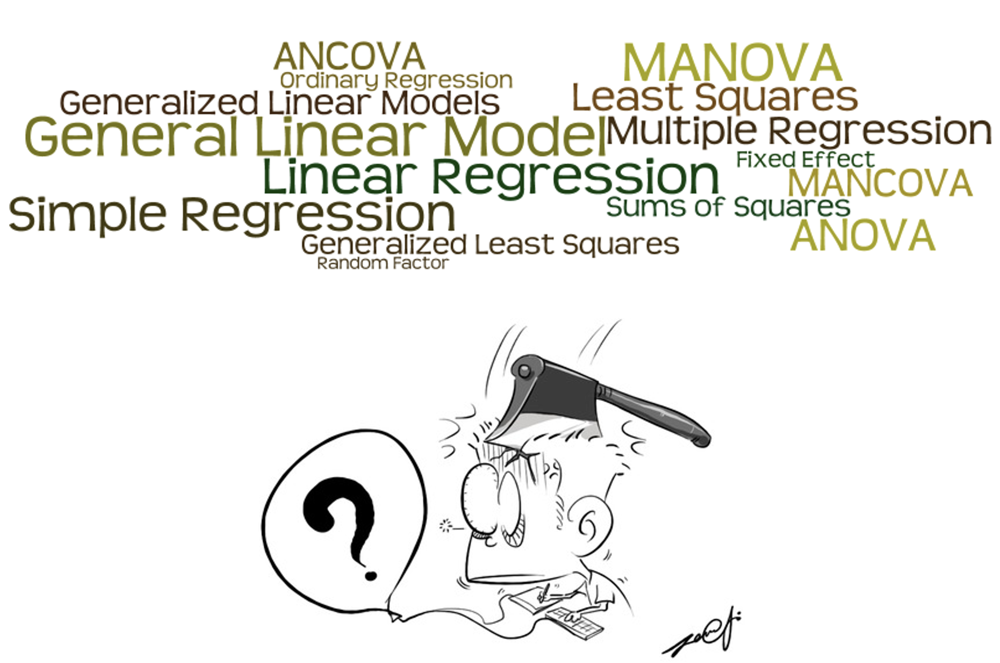  
```

# Thoughts on nomenclature
```{r, echo = FALSE, fig.align='center', out.width="100%"}
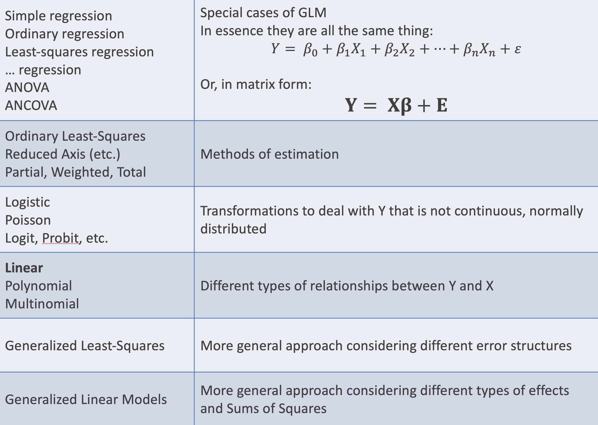  
```

# The General Linear Model
```{r, echo = FALSE, fig.align='center', out.width="80%"}
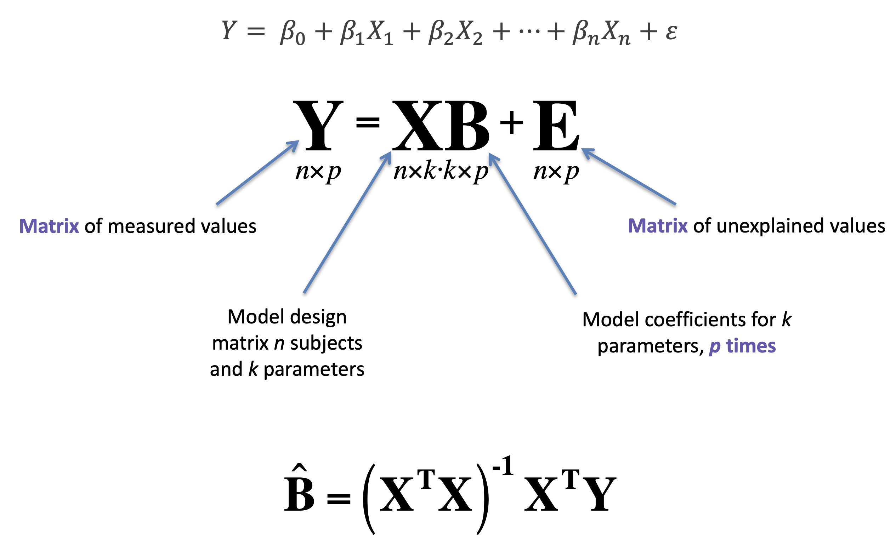  
```

>- The goal is to find a solution for which the estimated value of a data vector, given a vector of predictors, is expected to be true.

# GLM types
```{r, echo = FALSE, fig.align='center', out.width="100%"}
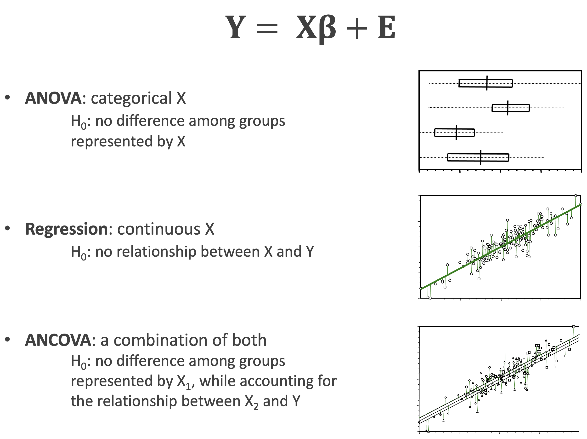  
```

# More on nomenclature
```{r, echo = FALSE, fig.align='center', out.width="100%"}
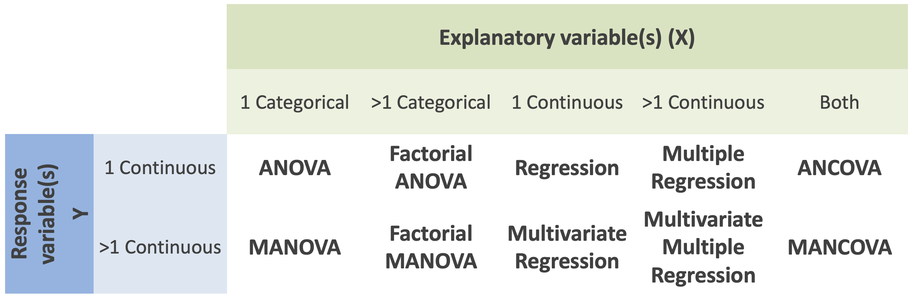  
```

>- **Multivariate** refers to the response variable(s) $\mathbf{Y}$
>- Sometimes the term *“multiple”* is used to denote > 1 explanatory variables $\mathbf{X}$

# The GLM matrices
$$
\begin{aligned}
Y = \beta_0 + \beta_1X_1 + \beta_2X_2 + \dots + + \beta_nX_n + \epsilon  
\end{aligned}
$$
$$
\begin{aligned}
\mathbf{Y = X\beta + E}
\end{aligned}
$$
- They are **all the same model!**  
- Only difference: data in $\mathbf{X}$  
- Works equally for univariate and multivariate $\mathbf{Y}$  

\

>- Dependent variables 
$$
\mathbf{Y =
\begin{bmatrix}
Y_{11} & Y_{12} & \cdots & Y_{1p} \\
Y_{21} & Y_{22} & \cdots & Y_{2p} \\
\vdots & \vdots & \ddots & \vdots \\
Y_{n1} & Y_{n2} & \cdots & Y_{np}
\end{bmatrix}
}
$$

>- Independent (predictor) variables
$$
\mathbf{X =
\begin{bmatrix}
1 & X_{11} &  \cdots & X_{1k} \\
1 & \vdots & \ddots & \vdots \\
1 & X_{n1} & \cdots & X_{nk}
\end{bmatrix}
}
$$

>- Solve for coefficients 
$$
\bf\unicode[Times]{x3B2} =
\begin{bmatrix}
\beta_{0} \\
\vdots \\
\beta_{p}
\end{bmatrix}
$$
>          found as $$ \bf\unicode[Times]{x3B2} = (X^TX)^{-1}(X^TY) $$

# GLM - estimation
$$ \bf\unicode[Times]{x3B2} = (X^TX)^{-1}(X^TY) $$

- This expresses **ALL types of General Linear Models!** 
- It is modified by including different types of data in X
- X may include categorical variables (factors), continuous predictors (covariates), combinations of the two, and interactions between them

\

>- Solving b this way minimizes the sum of squared residuals (error) and it is usually referred to as “*Least-Squares*” (LS) estimation
>- In other words, coefficients estimated from the model design, $\mathbf{X}$, will minimize the sum squared error between observed data and expected values 
>- As such, the error is an indication of how good the *fit of the model* is

# ANOVA, groups and the design matrix
- **AN**alysis **O**f **VA**riance: the procedure of evaluating any GLM by testing whether the inclusion of a term in a model causes a **change in residual variance**

. . . 

- More loosely (and generally) used to describe a GLM where X is a grouping factor
- Same model $$ \bf{Y} = X \unicode[Times]{x3B2} $$ same estimators $$ \bf\unicode[Times]{x3B2} = (X^TX)^{-1}(X^TY) $$

. . . 

- $\mathbf{X}$ describes *group membership*, and this is recoded into g-1 **dummy variables**
```{r, echo = FALSE}
Xtab <- matrix(c("A", "A", "B", "B", 0, 0, 1, 1), nrow = 4, byrow = F)
knitr::kable(Xtab, col.names = c("GROUP", "X1"),
             table.attr = "style='position: absolute; top: 50%; left: 50%; transform: translate(-50%, -50%);'")
```


# A Tale of Two Linear Models
*Other than to consider total dispersion in a data set, a linear model analysis always considers at least two models.*

Much of life is like this - the absolute definition of a state is difficult or meaningless, but the relative difference in states provides meaning to both.  (For example, if today is 3 degrees warmer than yesterday, we know something about the weather both today and yesterday, but finding an absolute meaning of temperature is not helpful.)  Whether a linear model is a good or poor model for how data are dispersed requires a comparison (especially to a null model).


# Linear Model Comparisons 

### An example

```{r, echo = FALSE, out.width="100%"}
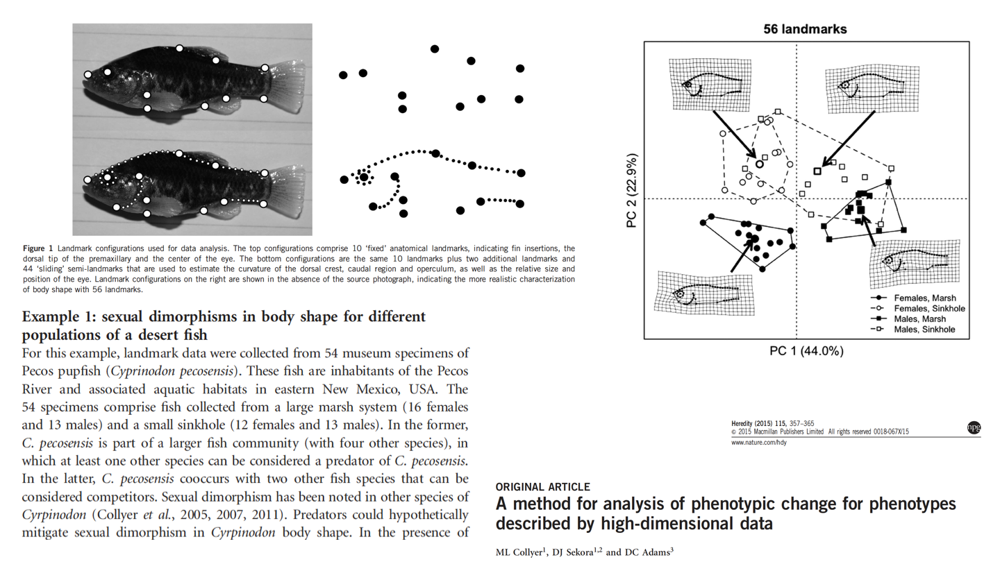  
```


# How Design Matrices Model Responses for Different Groups

Developing an intuition for how design matrices are constructed helps researchers better understand the analytical methods they are using.

There are different ways to construct model design matrices.  We will use the most traditional way, which is how **R** works.

The best way to illustrate this is with an example.

```{r echo = TRUE, include = TRUE}
library(geomorph)
data("pupfish")
# Make a new data frame with ony 8 fish (subjects 15-18, 40-43)
select <- c(15:18, 40:43)
df <- data.frame(logSize = log(Pupfish$CS),
                 Sex = Pupfish$Sex, 
                 Pop = Pupfish$Pop,
                 Group = interaction(Pupfish$Sex, Pupfish$Pop))
df <- data.frame(df[select, ])
```


# How Design Matrices Model Responses for Different Groups (cont.)

Let's make up a fictional response, just for illustrative purposes:

```{r echo = TRUE, include = TRUE}
y <- c(0, 2, 6, 4, 3, 3, 4, 7 )
y
```

# Design Matrices: Factors

Factors (categorical variables) require multiple variables for the various levels of the factor.  

```{r echo = TRUE, include = TRUE}

model.matrix(~ Group, data = df)

```


# Design Matrices: Factors (cont.)

#### Key points


Let's revisit this description from before (next slide)


# Vectors are Points in Space
```{r, echo = FALSE, out.width="100%"}
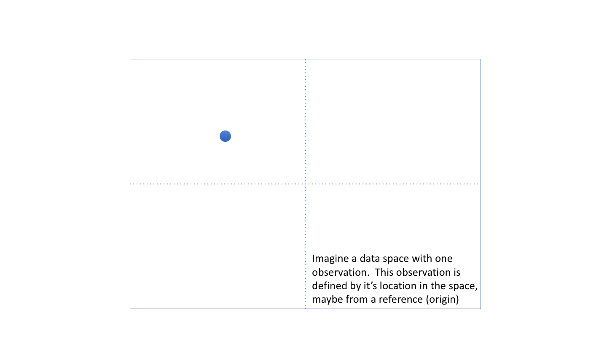  
```

# Vectors are Points in Space (Cont.)
```{r, echo = FALSE, out.width="100%"}
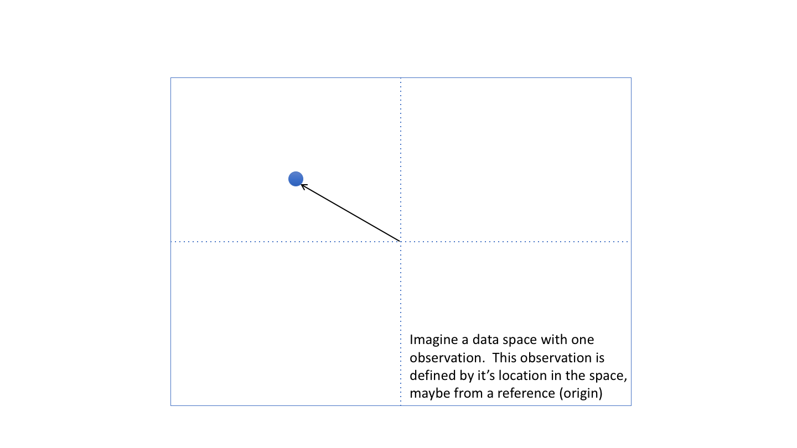  
```

# Vectors are Points in Space (Cont.)
```{r, echo = FALSE, out.width="100%"}
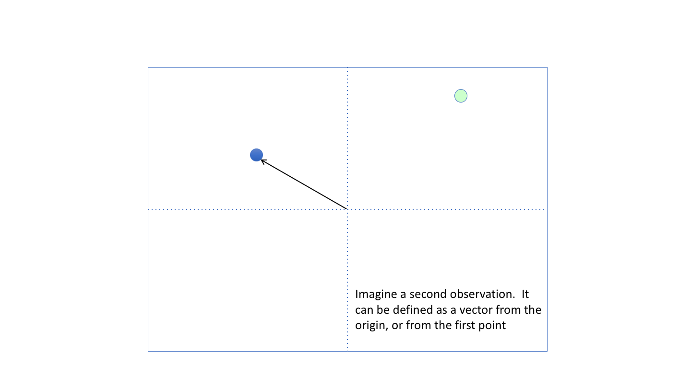  
```

# Vectors are Points in Space (Cont.)
```{r, echo = FALSE, out.width="100%"}
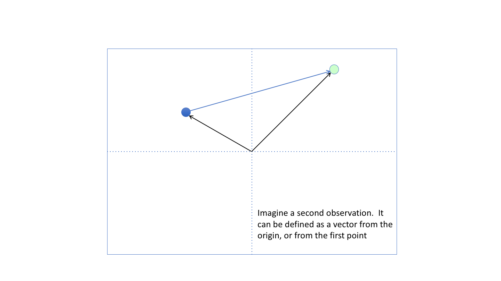  
```

# Vectors are Points in Space (Cont.)
```{r, echo = FALSE, out.width="100%"}
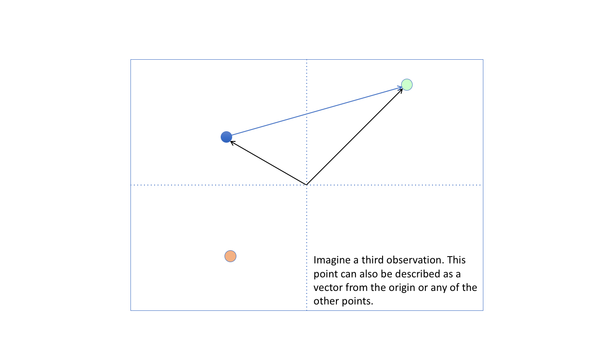  
```

# Vectors are Points in Space (Cont.)
```{r, echo = FALSE, out.width="100%"}
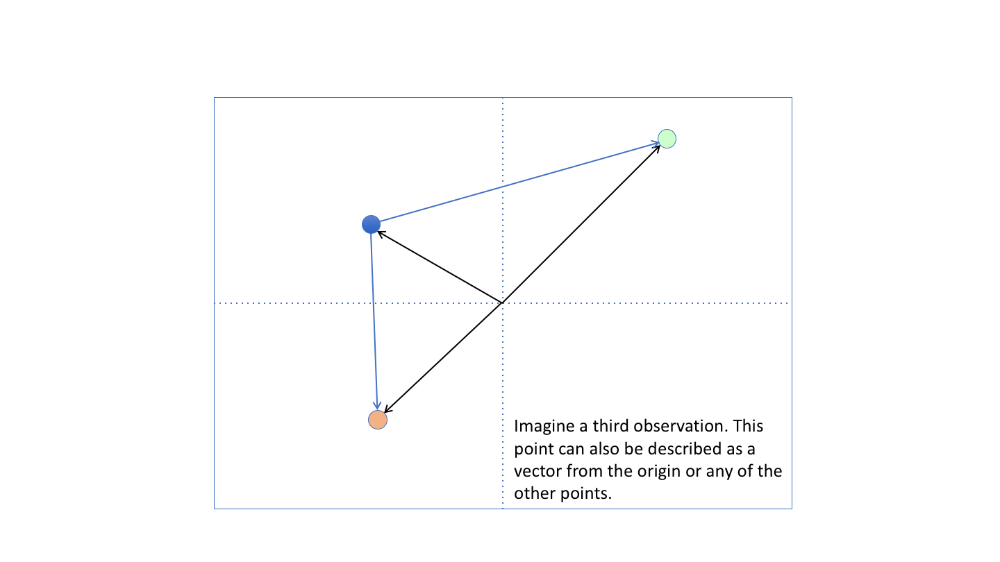  
```

# Vectors are Points in Space (Cont.)
```{r, echo = FALSE, out.width="100%"}
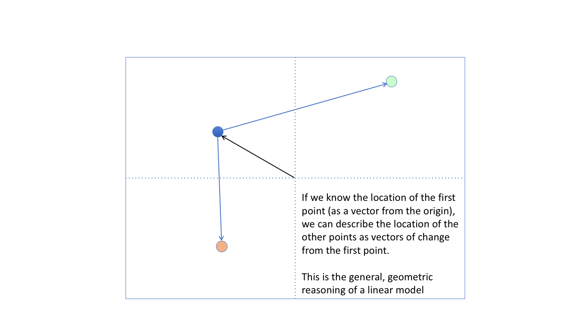  
```

# Design Matrices: Factors

Factors (categorical variables) require multiple variables for the various levels of the factor.  

```{r echo = TRUE, include = TRUE}

model.matrix(~1, data = df)
model.matrix(~ Group, data = df)

```

# Design Matrices: Factors (cont.)

The point is that means can be described as vectors from the origin or from a first mean.  Let's see how this works with the **R** example

```{r echo = TRUE, include = TRUE}

X0 <- model.matrix(~ 1, data = df)
Xg <- model.matrix(~ Group + 1, data = df) 

B0 <- solve(crossprod(X0)) %*% crossprod(X0, y) # find the overall mean of y
Bg <- solve(crossprod(Xg)) %*% crossprod(Xg, y) # find group means 

B0 # the overall mean
mean(y)
```

# Design Matrices: Factors (cont.)


```{r echo = TRUE, include = TRUE}
Bg
```

The way to interpret these coefficients is to change an intercept equal to the first value by the amount indicated by the subsequent coefficients.

Note that in R, one can do this

```{r echo = TRUE, include = TRUE}
by(y, df$Group, mean)
```
#### Wait!  These values are different!

# Design Matrices: Factors (cont.)

Remember that fitted values are found as $\mathbf{\hat{Y}} = \mathbf{X\hat{\beta}}$.  Remember also *run amok computational demon*!

```{r, echo = FALSE, out.width="100%"}
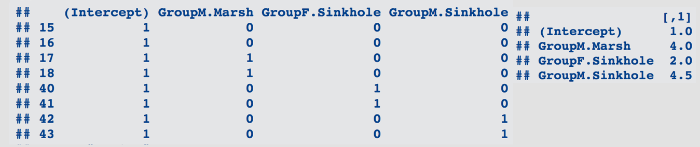  
by(y, df$Group, mean)
```

# Geometric Interpretation of Model Effects

```{r, echo = FALSE, out.width="100%"}
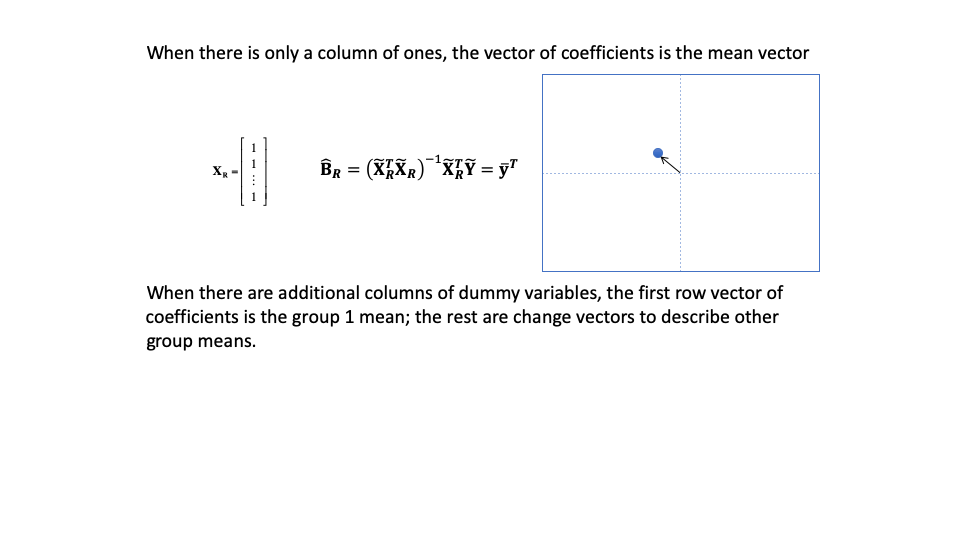  
```

# Geometric Interpretation of Model Effects (cont.)

```{r, echo = FALSE, out.width="100%"}
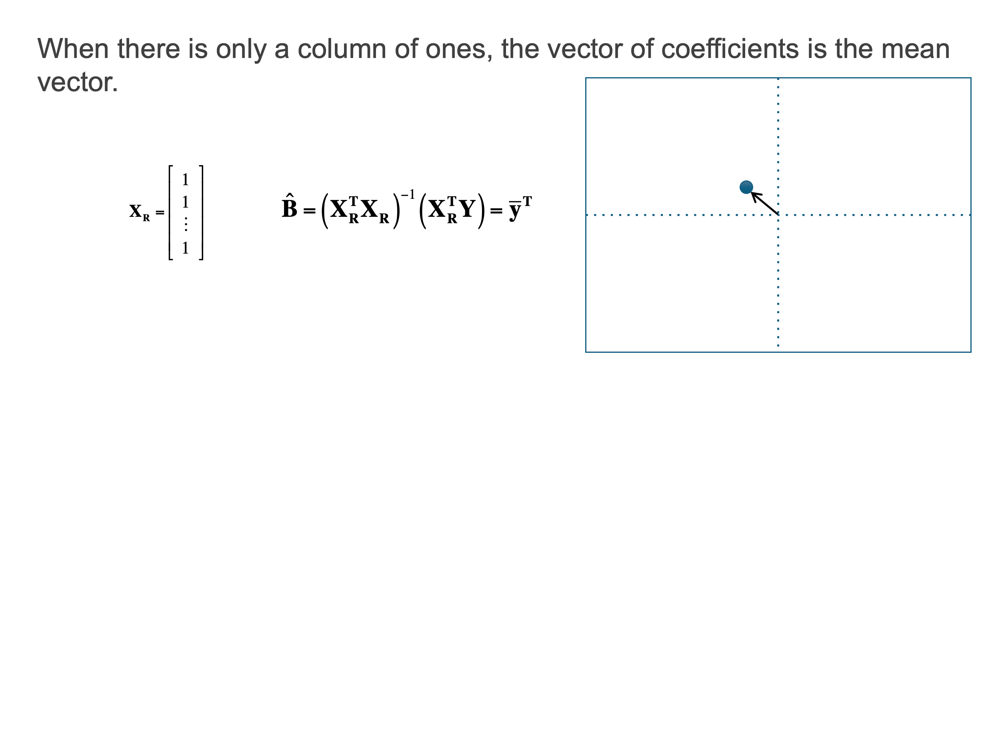  
```

# Geometric Interpretation of Model Effects (cont.)

```{r, echo = FALSE, out.width="100%"}
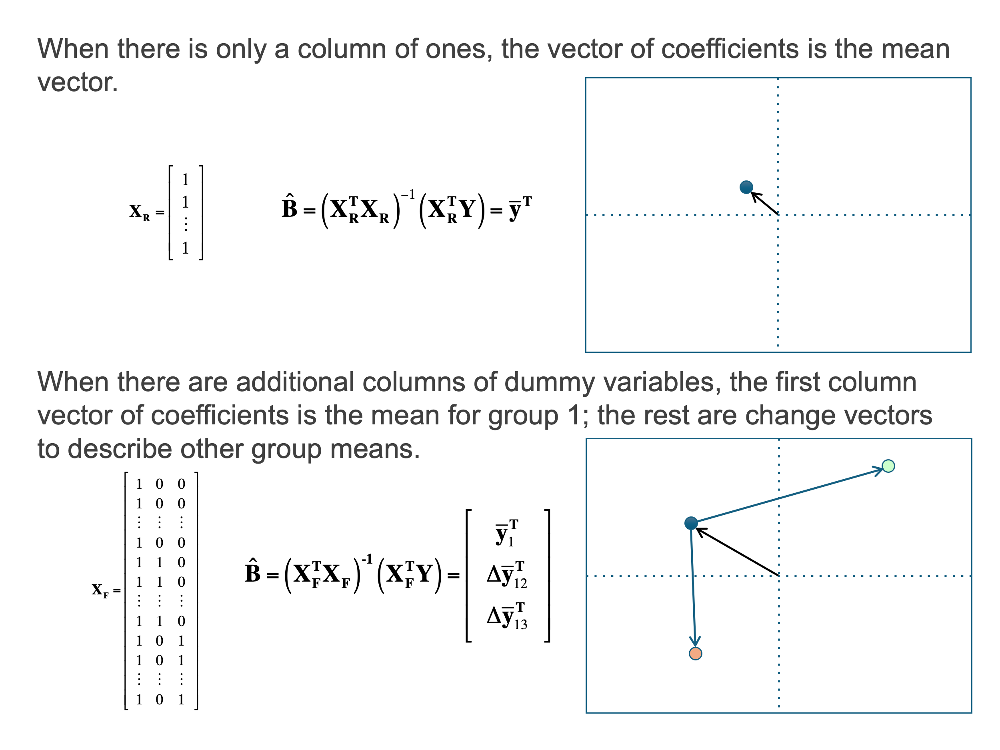  
```

# Geometric Interpretation of Model Effects (cont.)

```{r, echo = FALSE, out.width="100%"}
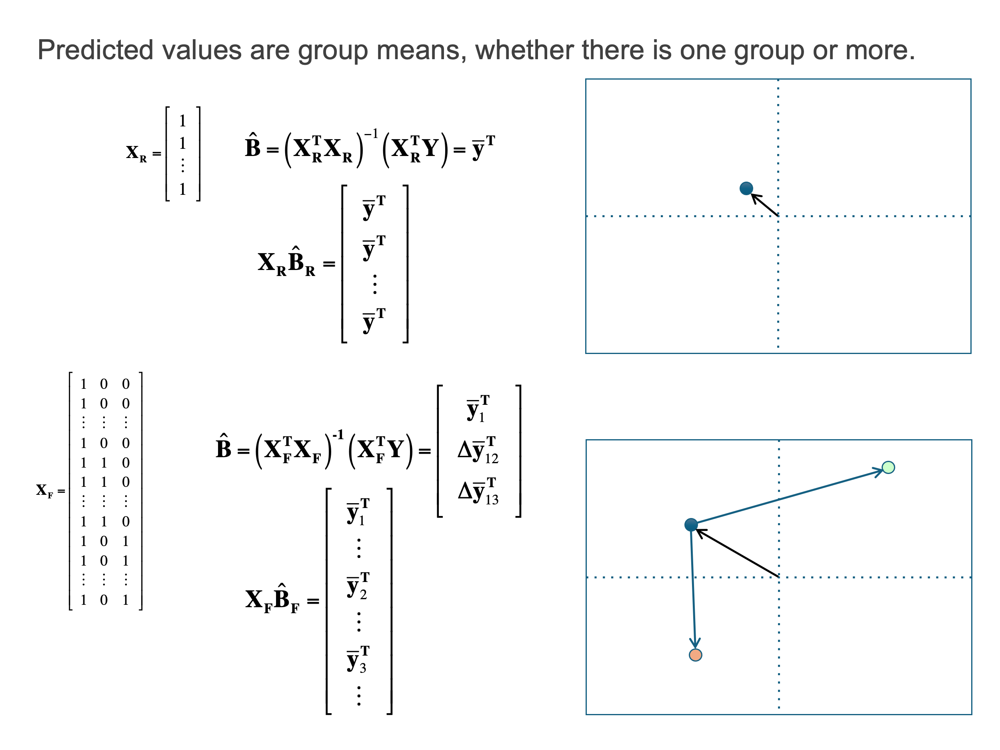  
```

# Geometric Interpretation of Model Effects (cont.)

```{r, echo = FALSE, out.width="100%"}
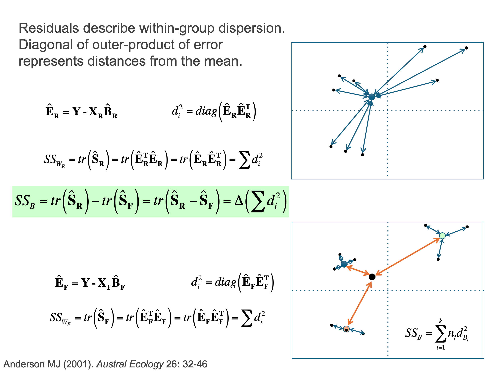  
```

# Geometric Interpretation of Model Effects (cont.)

```{r, echo = FALSE, out.width="100%"}
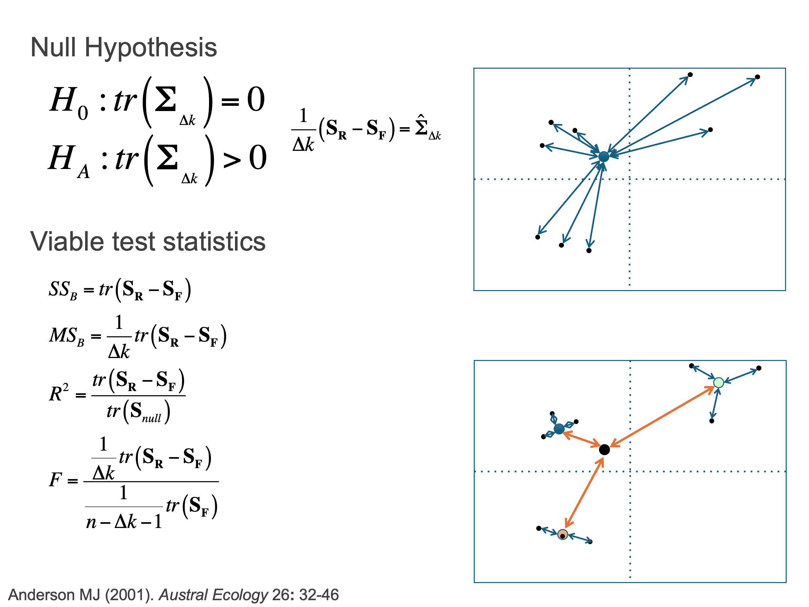  
```

# Geometric Interpretation of Model Effects (cont.)

```{r, echo = FALSE, out.width="100%"}
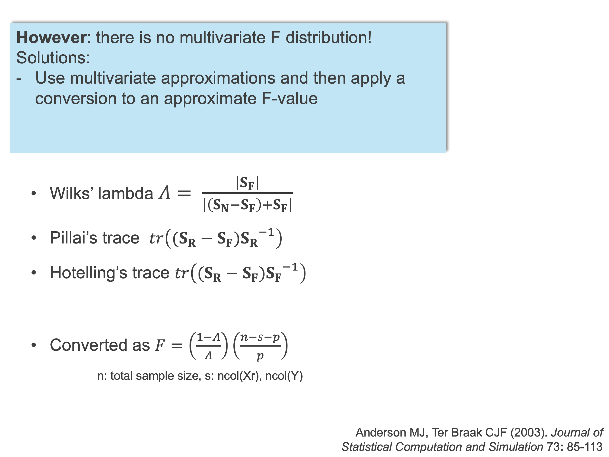  
```

# ANOVA

Analysis of variance is used for determining the *significance* of group differences (whether group means are a better estimate of shape than the grand mean).  For shape data, using randomization of residuals in a permutation procedure (RRPP) is the best way to go (Collyer et al. 2015; Adams & Collyer 2016, 2018)

The equation for RRPP:

$$\mathbf{\mathcal{Y}} = \mathbf{\hat{Y}} + \mathbf{E}_{\left[s,\right]}^*$$

In words, random pseudo-values are generated by holding the transformed fitted values of a (**reduced**) model constant and randomizing only the transformed residuals.  The subscript of the transformed residuals indicates that the rows of the matrix are shuffled, according to $s$, which is a randomized form of the sequence, $1,2,3,...,n$.

###### Collyer et al. *Heredity.* (2015); Adams & Collyer. *Evolution.* (2016); Adams & Collyer. *Evolution.* (2018)

# RRPP and Empirical Null Sampling Distributions

1. Perform RRPP (randomize residuals many permutations).  
2. Calculate $F$-value in every random permutation (observed case counts as one permutation)
3. For $N$ permutations, $P = \frac{N(F_{random} \geq F_{obs})}{N}$
4. Calculate *effect size* as a standard deviate of the observed value in a normalized distribution of random values (helps for comparing effects within and between models); i.e.,
$$z = \frac{
\log\left( F\right) - \mu_{\log\left(F\right)}
} {
 \sigma_{\log\left(F\right)}
}$$
where $\mu_{\log\left(F\right)}$ and $\sigma_{\log\left(F\right)}$ are the expected value and standard deviation from the sampling distribution, respectively (Collyer et al. 2015; Adams and Collyer 2016, 2018).

###### Collyer et al. *Heredity.* (2015); Adams & Collyer. *Evolution.* (2016); Adams & Collyer. *Evolution.* (2018)

# ANOVA (cont.)

Returning to our previous example

```{r echo = TRUE, include = TRUE}

fit <- procD.lm(y ~ Group, data = df, print.progress = FALSE)
anova(fit)

```

- Group $SS$ is the sum of squared distances between means.
- Residual $SS$ is the sum of squared distances between observations and their means.
- Total $SS$ is the sum of squared distances between observations and the **grand** mean.
- The rest is a determination if the mean squared distances differ significantly.

# ANOVA (cont.)

#### Using a better example: body shape 

```{r echo = TRUE, include = TRUE}

pupfish$Group <- interaction(Pupfish$Sex, Pupfish$Pop)
fit <- procD.lm(coords ~ Group, data = pupfish, print.progress = FALSE)
anova(fit)

```

# ANOVA (cont.)

#### Using a better example: body shape 

```{r echo = TRUE, include = TRUE, out.width="100%"}

plot(fit, type = "PC", pch = 21, bg = pupfish$Group)
legend("topright", levels(pupfish$Group), pch = 21, pt.bg = 1:4)
```
```{r echo = FALSE, include = TRUE, out.width="100%"}
 
```

# Design Matrices: Factors (cont.)

```{r, echo = FALSE, out.width="100%"}
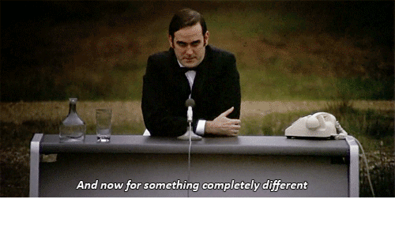  
```

# Design Matrices: Factorial Models

#### Not really!  Now for something not at all different!

```{r echo = TRUE, include = TRUE}

Xf <- model.matrix(~ Sex * Pop, data = df) 
Bf <- solve(crossprod(Xf)) %*% crossprod(Xf, y) 

Xf
Bf
```

# Design Matrices: Factorial Models (Cont.)

Note the redundancy

```{r echo = TRUE, include = TRUE}

Xg %*% Bg
Xf %*% Bf
```

# Design Matrices: Factorial Models (Cont.)

So why bother with a more complicated model design matrix?

Because these do not make sense unless this **factorial** design was used

```{r echo = TRUE, include = TRUE}

model.matrix(~ Sex, data = df)
model.matrix(~ Sex + Pop, data = df)
```


# Design Matrices: Factorial Models (Cont.)

So why bother with a more complicated model design matrix?

The two models before were sub-models of this full one

```{r echo = TRUE, include = TRUE}

Xf
```

# Design Matrices: Factorial Models (Cont.)

With a factorial model, $SS$ can be partitioned (with type I $SS$) for more effects, and greater inference is possible.


```{r echo = TRUE, include = TRUE}
fitg <- procD.lm(y ~ Group, data = df, iter = 999, SS.type = "I", print.progress = FALSE)
fitf <- procD.lm(y ~ Sex * Pop, data = df, iter = 999, SS.type = "I", print.progress = FALSE)

anova(fitg)
anova(fitf)
```


# A More Practical Example (from before)

```{r echo = TRUE, include = TRUE}
fitPup <- procD.lm(coords ~ Sex * Pop, data = pupfish, iter = 999, SS.type = "I", print.progress = FALSE)
anova(fitPup)
```

# A More Practical Example (from before, Cont.)

```{r echo = TRUE, include = TRUE}
plot(fitPup, type = "PC", pch = 21, bg = pupfish$Group)
legend("topright", levels(pupfish$Group), pch = 21, pt.bg = 1:4)
```


#### Conclusion (with visual help): The interaction between $Sex$ and $Population$ was significant, which indicated sexual dimorphism varied between populations.  There is greater sexual dimorphism in the Marsh population compared to the Sinkhole population.

# Design Matrices: Factorial Models (Cont.)

One last comment about the factorial model design,

```{r, echo = FALSE, out.width="100%"}
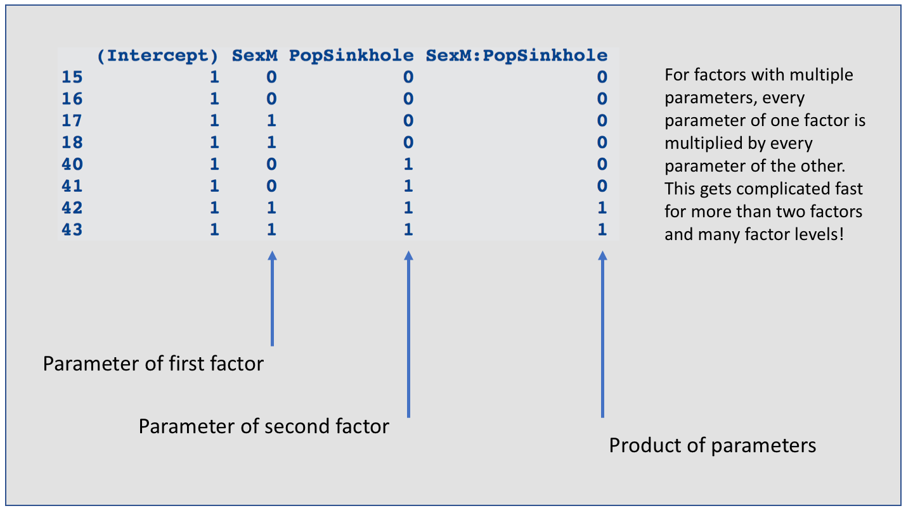  
```


# Multiple Model Effects

It  might be apparent with the previous example, or any other example with which one might familiar, that there is often more than a null model and a full model.  There might be different **effects** that could be considered for different sets of parameters.  In the pupfish example, we might ask whether $Sex$ or $Population$ contribute more to the dispersion in means.  We might also wonder if the $Sex$ effect varies between populations.

Not to worry!  The model comparison approach can be done in sequence for different model effects.  There are only a few little twists with which to be concerned.

#### Preliminaries:
1. Let **null** refer to the model with only an intercept and whose purpose is to estimate an overall mean.
2. Let **reduced** refer to a model with limited parameters, which serves as a basis for comparison.
3. Let **full** refer to a model with all parameters of the reduced model, plus parameters for an effect of interest.

In the initial pupfish example, the null and reduced models were the same; the full model had parameters to estimate four group means.  We are going to use the same model now to consider partial effects associated with the dispersion of the four means.


# Multiple Model Effects (Type I SS)

In the pupfish example, we could have the following set of model comparisons to estimate different effects

Effect | Reduced | Full | Purpose
:----- | :------- | :------- | :-------------
Sex | Null | Null + Sex | Determine if Sex mean difference is "significant" compared to an overall mean
Pop | Null + Sex | Null + Sex + Pop | Determine if population differences are significant, after accounting for general difference between males and females
Sex:Pop | Null + Sex + Pop | Null + Sex + Pop + Sex:Pop | Determine if sexual dimorphism varies between populations, after accounting for general difference in sex and population.
Full model | Null | Null + Sex + Pop + Sex:Pop | Ascertain if the model is significant (if not, the other parts should not be considered significant either)

Estimating $SS$ between models for the first three model comparisons is called **Sequential (Type I) $SS$** estimation.  We start with a null model and build up to the fullest model.

# Multiple Model Effects (Type II SS)

In the pupfish example, we could have the following set of model comparisons to estimate different effects

Effect | Reduced | Full | Purpose
:----- | :------- | :------- | :-------------
Sex | Null + Pop | Null + Pop + Sex | Determine if Sex mean difference is "significant", after accounting for population mean difference
Pop | Null + Sex | Null + Sex + Pop | Determine if population differences are significant, after accounting for general difference between males and females
Sex:Pop | Null + Sex + Pop | Null + Sex + Pop + Sex:Pop | Determine if sexual dimorphism varies between populations, after accounting for general difference in sex and population.
Full model | Null | Null + Sex + Pop + Sex:Pop | Ascertain if the model is signficant (if not, the other parts should not be considered significant either)

Estimating $SS$ between models for the first three model comparisons is called **Conditional (Type II) $SS$** estimation.  We analyze effects with respect to other effects, but do not include interactions with targeted effects.  For example, with three factors, A, B, and C.  The effect A would have a reduced model of B, C, and B:C.  The full model would add A to these.  The effect A:B, would have a reduced model of A, B, C, and B:C, and the full model would add A:B to these. 

# Multiple Model Effects (Type III SS)

In the pupfish example, we could have the following set of model comparisons to estimate different effects

Effect | Reduced | Full | Purpose
:----- | :------- | :------- | :-------------
Sex | Null + Pop + Pop:Sex| Null + Pop + Sex + Pop:Sex| Determine if Sex mean difference is "significant", after accounting for all other effects
Pop | Null + Sex + Pop:Sex| Null + Sex + Pop + Pop:Sex| Determine if population differences are significant, after accounting for all other effects.
Sex:Pop | Null + Sex + Pop | Null + Sex + Pop + Sex:Pop | Determine if sexual dimorphism varies between populations, after accounting for general difference in sex and population.
Full model | Null | Null + Sex + Pop + Sex:Pop | Ascertain if the model is signficant (if not, the other parts should not be considered significant either)

Estimating $SS$ between models for the first three model comparisons is called **Marginal (Type III) $SS$** estimation.  Whereas Type I $SS$ evaluates the importance of effects through inclusion, Type III $SS$ evaluates the importance of effects through exclusion.

# Example: Types of SS

```{r echo = TRUE, include = TRUE}
fit1 <- procD.lm(coords ~ Pop * Sex, data = pupfish, iter = 999, SS.type = "I", print.progress = FALSE)
fit2 <- procD.lm(coords ~ Pop * Sex, data = pupfish, iter = 999, SS.type = "II", print.progress = FALSE)
fit3 <- procD.lm(coords ~ Pop * Sex, data = pupfish, iter = 999, SS.type = "III", print.progress = FALSE)

anova(fit1)
anova(fit2)
anova(fit3)
```

# Multiple Model Effects (comments)

- $F$-values for multiple model effects use the residual $MS$ for the fullest model, under most circumstances.  (There are cases where this is not true, if we have random effects.  This is a topic for a different workshop, but *geomorph* functions can handle this.)
- Only Sequential addition of model terms ensures that the summation of various $SS$ for effects is the same as the whole model $SS$.
- With Type I $SS$ one has to consider the order of variables; this is not the case with Types II and III $SS$.
- Model design might determine which method to use.  Types II and III $SS$ are sometimes recommended for imbalanced designs or many two-way interactions.
- In general, significant effects will be significant, regardless of method, but if there is multi-collinearity among independent variables, Type II $SS$ can reveal it (Type I $SS$ might suggest the first effect added is meaningful compared to others).


# Digging deeper: Pairwise Comparisons (more on interactions)

Let's return to the pupfish body shape example.

An astute observer might start to wonder which pupfish means are different form each other?  

One thing of which to be aware, models with interactions provide so much more opportunity than simpler single-factor models.  Recall that these models produce the same means:


```{r echo = TRUE, include = TRUE}

fitg <- procD.lm(coords ~ Group, data = pupfish, print.progress = FALSE, iter = 999)
fitf <- procD.lm(coords ~ Pop * Sex, data = pupfish, print.progress = FALSE, iter = 999)
fitg
fitf
```

Let's see, however, how pairwise hypothesis tests differ between them.

# Pairwise Comparisons

There are two statistics for pairwise comparisons that might be of interest.  Recall that any estimated value is a vector.  A vector has two attributes: length and direction.  With two or more vectors, these attributes are related.  Anyone who has studied trigonometry can attest that two vectors originating from the same point (origin) describe a triangle.  The vectors are orientated with an angle between them, and 
the vector between vector endpoints is also a vector with a direction and length (distance).  The following figure illustrates this.

```{r, echo = FALSE, out.width="100%"}
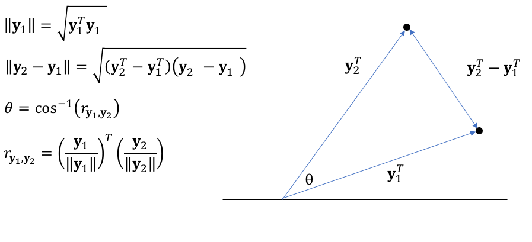  
```

The attributes, vector length (distance, $d$) and angle ($\theta$), can function as test statistics. These statistics have an expected value of 0 under a null hypothesis. (Vector correlation can also be a test statistic, but it has an expected value of 1 for parallel vectors, which is a bit awkward.)

# Pairwise Comparisons (Cont.)

Here is the beautiful thing!  I mean this is really, really awesome!

When performing RRPP, we have thousands of random outcomes of coefficients (vectors).  These might represent different slopes or ways to estimate vectors between means.  Therefore, we inherently have distributions of these geometric statistics.  **There is no need for a post-hoc, manufactured test!  We can simply generate** *in situ* **distributions from the resampling experiment!**

```{r echo = TRUE, include = TRUE}

PWG <- pairwise(fitg, groups = pupfish$Group)
PWF <- pairwise(fitf, groups = pupfish$Group)

PWG
PWF
```

For any pairwise test, there is a null model.  Let's see the null models for these pairwise tests:

```{r echo = TRUE, include = TRUE}

reveal.model.designs(fitg)
reveal.model.designs(fitf)
```

# Pairwise Comparisons, Example 

Now we have choices!  For example,

```{r echo = TRUE, include = TRUE}

summary(PWG, test.type = "dist") # "dist" for distance between vectors
```

# Pairwise Comparisons, Example (Cont.)

Now we have choices!  For example,

```{r echo = TRUE, include = TRUE}

summary(PWF, test.type = "dist") # "dist" for distance between vectors
```

# Pairwise Comparisons, Example (Cont.)

Note that in this example, we used `test.type = "dist"` because it makes sense to look at the differences among means in terms of how spread out they are in the data space.  Also notice the similarities and differences between the two tests:

```{r, echo = FALSE, out.width="100%"}
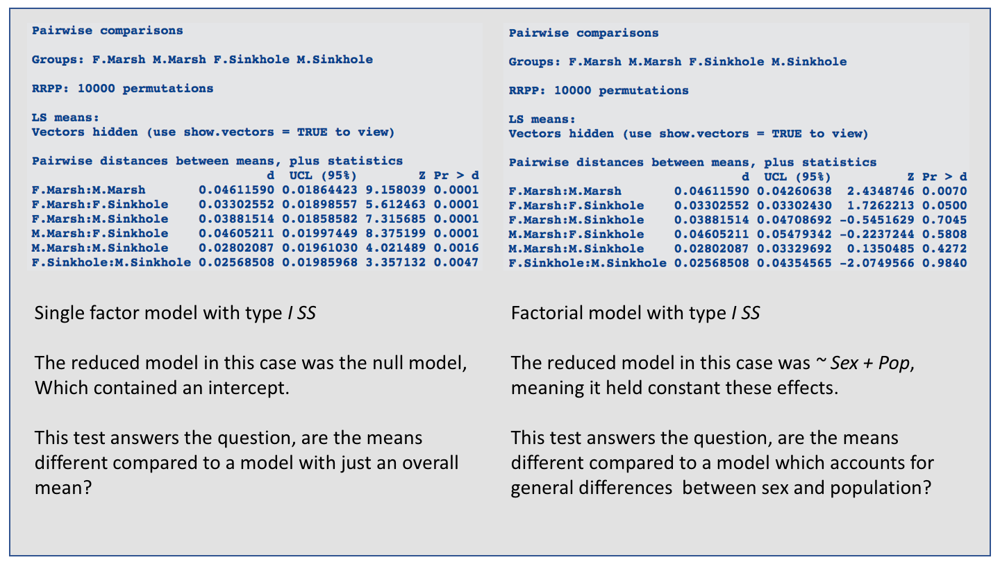  
```

# Pairwise Comparisons, Example (Cont.)

The latter test makes sense, if we look again at the PC plot 

```{r echo = TRUE, include = TRUE}
plot(fitf, type = "PC", pch = 21, bg = pupfish$Group)
legend("topright", levels(pupfish$Group), pch = 21, pt.bg = 1:4)
```

The first test tells use means are different.  The second test tells use that despite population differences in shape and despite sexual dimorphism, in general, the sexual dimorphism in the Marsh population is greater than the sexual dimorphism in the sinkhole population.

# Pairwise Comparisons, Example (Cont.)

What about comparing slopes among groups that might have different patterns of covariation?  

##### We will explore that in the allometry lecture
##### We will also explore ANCOVA designs as lab examples

# Summary

- Group shape differences via linear models
- ANOVA means comparing two models in a systematic way
  + SS types: I, II, III
- RRPP makes ANOVA possible
- RRPP also means pairwise statistics are inherently generated
- Pairwise statistics are geometric attributes

- More on pairwise approaches in *Trajectory Analysis* and *Allometry*
