# Generalized Procrustes Analysis
<style>
.slide h1 {
  margin-top: 15px !important;
}

/* This creates the fade-in animation */
@keyframes fadeIn {
  from { opacity: 0; }
  to   { opacity: 1; }
}

/* This applies it to every slide */
.slide {
  animation: fadeIn 0.8s ease-in-out;
}

/* Target the incremental list items */
.incremental > li, .incremental > p {
  animation: fadeIn 0.6s ease-in-out;
}

/* Remove extra indentation from the incremental container */
.incremental {
  margin-left: 0.2 !important;
  padding-left: 0.5 !important;
}

/* Ensure the list items themselves match your standard list style */
ul.incremental, ol.incremental {
  margin-left: 1.5em; /* Adjust this value to match your main theme */
}

/* This changes the body text */
body, div, p {
  font-family: Lucida Console, sans-serif;
}

/* This changes the headers */
h1, h2, h3 {
  font-family: Lucida Console, sans-serif;
  color: #6954b0;
}

</style>

```{r setup, include=FALSE, echo = TRUE, tidy = TRUE}
library(knitr)
library(geomorph)
opts_chunk$set(echo = TRUE)
```

- Align objects to common coordinate system using superimposition (GPA)

$$\small\mathbf{Z}=\frac{1}{CS}\mathbf{(Y-\overline{Y})H}$$

- Standardize ‘nuisance’ parameters ($\small{CS}$, $\small\mathbf{H}$, $\small\mathbf{\overline{Y}}$) as:
    - $\small\mathbf{\overline{Y}}$ = translate centroid to the origin
    - $\small{CS}$ = scale by centroid size
    - $\small\mathbf{H}$ rigid rotation (based on optimal angle using all landmarks)

- Works for both 2-D and 3-D landmarks data
- *THE* fundamental approach for morphometrics

# The Problem with Curves I
- Landmarks provide rigorous quantification of shape
- Some objects have few landmarks, but have defined boundaries (curves) or surfaces

```{r, echo = FALSE, out.width="100%"}
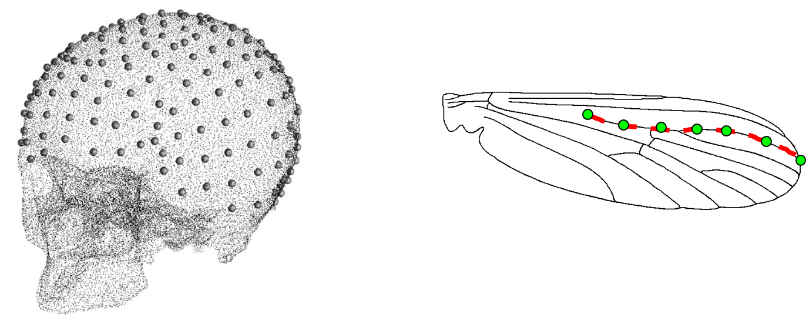  
```

>- How do we capture shape information from such structures? 

# The Problem with Curves II
- Some objects contain multiple ‘types’ of morphometric data
- Types typically analyzed separately

```{r, echo = FALSE, out.width="100%"}
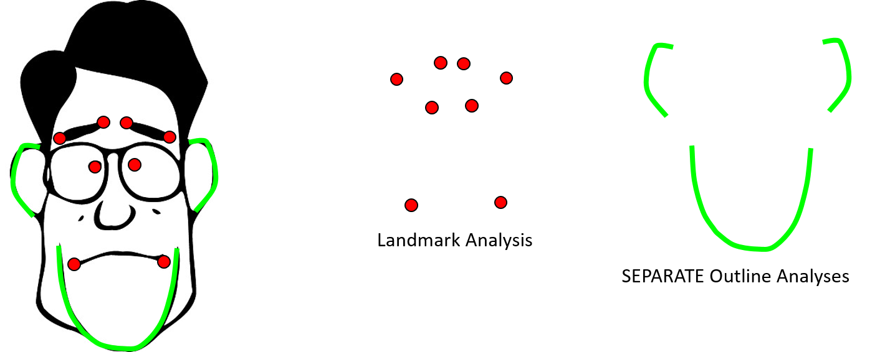  
```

>- How do we quantify the overall shape of such structures? 

# Mathematically-Defined Points: Problems
- Define landmark homology mathematically (e.g., equal spacing)
- Often produce suggestive (but incorrect) results 

```{r, echo = FALSE, out.width="100%"}
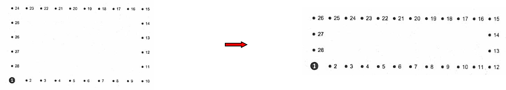  
```

. . . 

- Implied shape differences:
```{r, echo = FALSE, out.width="100%"}
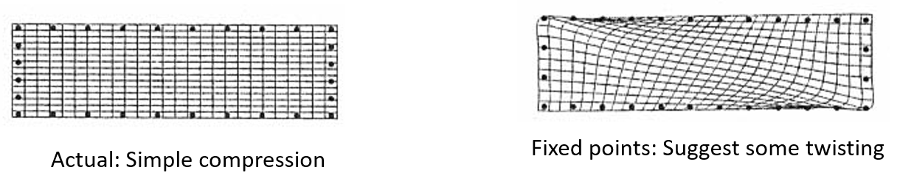  
```

###### Example from: Gunz et al. (2005) in *Modern morphometrics in physical anthropology.* 

# Mathematically-Defined Points: Problems (Cont.)
- Another example

```{r, echo = FALSE, out.width="100%"}
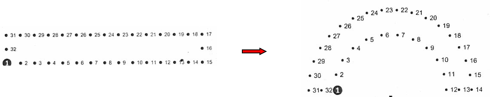  
```

. . . 

- Implied shape differences:
```{r, echo = FALSE, out.width="100%"}
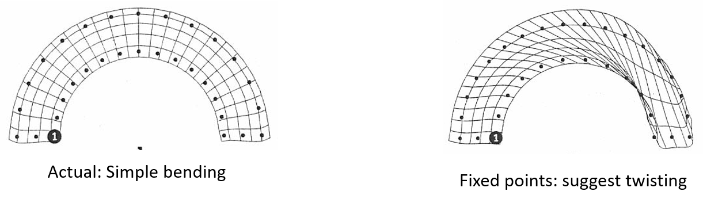  
```

###### Example from: Gunz et al. (2005) in *Modern morphometrics in physical anthropology.* 

>- Can we estimate the shape difference without adding the twisting?

# Semilandmarks and Procrustes Relaxation
- Procrustes superimposition of 2D points and curves (Bookstein 1997)
- Points along curves are *‘degenerate’* landmarks (**semilandmarks**)
- Semilandmarks constrained to be on the curve (thus have $\small{\approx{1}}$ df)

>- Digitize a set number of points along an outline, and allow them to ‘slide’ along curve to improve the fit of a specimen to a reference curve: minimize difference between them
>- Treat as points for standard landmark analysis (GPA+TPS)

###### Bookstein (1997) *Med. Image Anal.*

# Procrustes Relaxation: Conceptual Procedure
* Incorporate 'sliding' of semilandmarks into GPA algorithm
* GPA algorithm with sliding landmarks: Procedure
    
    * 1: Translate and scale specimens
    * 2: LS rotation, find consensus
    * 3: **‘Slide’ landmarks along curve in some way**
    * 4: Perform GPA to obtain new consensus
    * 5: Iterate steps 2-5 to improve fit

\

>- Two analytical issues:
    - What direction to slide?
    - How far to slide?
    
# What Direction to Slide?
```{r, echo = FALSE, out.width="50%"}
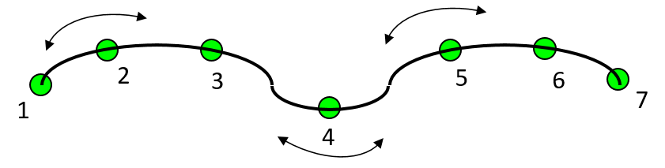  
```

\

- Slide landmarks along curve
- Adjacent points on curve define sliding directions

# How Far to Slide?
- Most conservative approach: slide to minimize shape differences
- Two criteria: bending energy ($\small{BE}$) & Procrustes distance ($\small{D}_{Proc}$) 


###### Statistical note: Sliding by $\small{D}_{Proc}$ assumes independence of semilandmarks (this is not realistic).


# Semilandmarks: Differing Approaches
- Visual differences between $\small{BE}$ and $\small{D}_{Proc}$ sliding:

```{r, echo = FALSE, out.width="70%"}
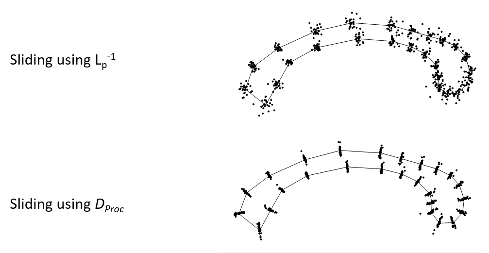  
```

###### Mathematical comments: Using $\small{BE}$ is akin to a weighted regression, which accounts for spatial proximity (non-independence) of adjacent landmarks. This is a more reasonable model, as one uses semilandmarks *precisely* to represent curves by an adjacent set of points which are explicitly not independent

# Combining Points and Curves
```{r, echo = FALSE, out.width="30%"}
  
```

- One can allow landmarks to remain 'fixed' while semilandmarks slide (e.g. endpoints above)

# Combining Landmarks and Curves: Example
- Cranial profiles in *Homo*
- External differences in frontal bones of archaic and modern humans are well-known
- Archaic humans have ‘frontal flattening’ while modern human crania are more vertically rounded
- Common anthropological interpretation:  more-rounded crania in modern humans due to enlargement of frontal lobes of brain  

- Profiles of internal and external frontal bones were digitized from 5 mid-Pleistocene and Neanderthal crania, and 16 modern humans and compared

###### Bookstein et al. (1999). Anatomical Record.

# Semilandmark Example: The Data
```{r, echo = FALSE, out.width="100%"}
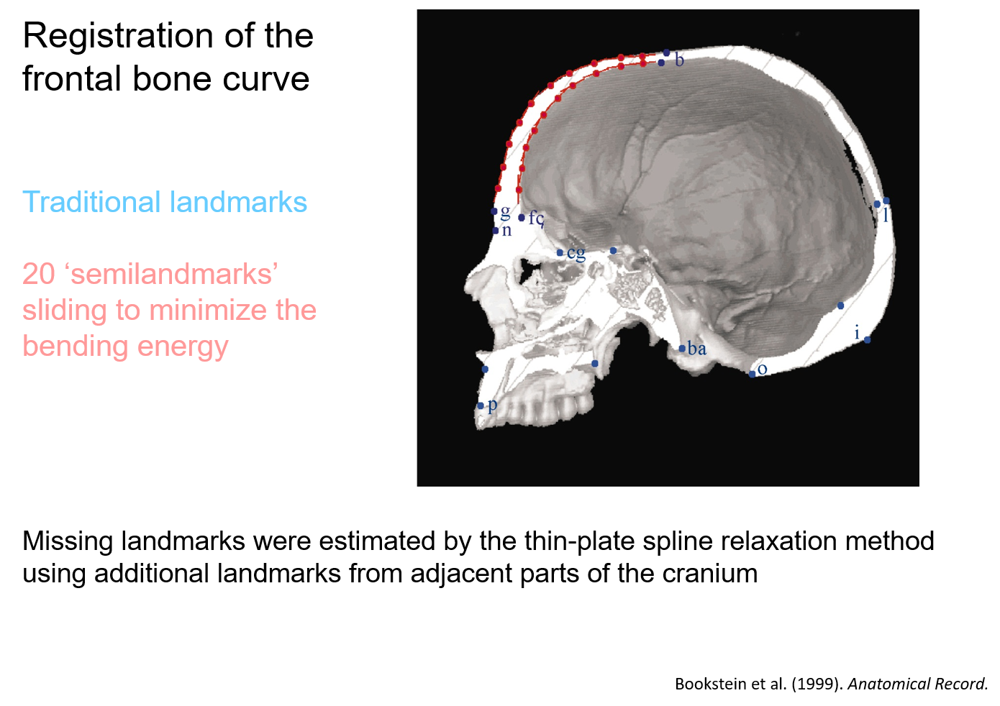  
```

# Semilandmark Example: The Data
```{r, echo = FALSE, out.width="100%"}
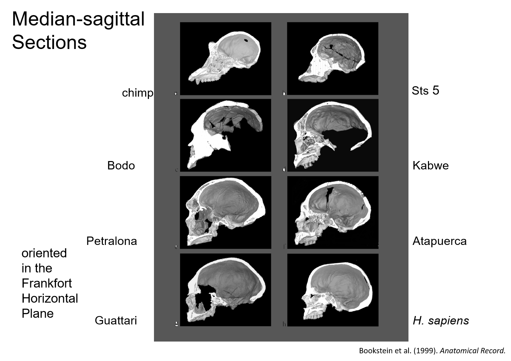  
```

# Semilandmark Example: Results
- Large differences in external profiles, but NO difference of internal profiles

```{r, echo = FALSE, out.width="100%"}
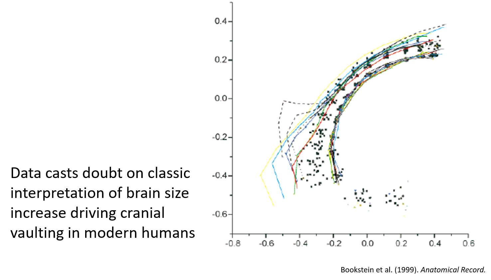  
```

# Semilandmarks on 3D Curves and on Surfaces
- Semilandmarks on 3D curves work identically, by defining tangent directions of $\small\Delta{x}$, $\small\Delta{y}$, and $\small\Delta{z}$

\ 

. . . 

- 3D surface landmarks slide in the plane
- Plane defined by PC1 & PC2 of surrounding points

```{r, echo = FALSE, out.width="30%"}
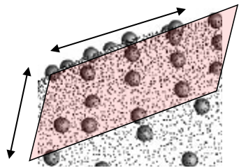  
```

Slide using $\small{BE}$ or $\small{D}_{Proc}$ as before


# Defining Semilandmarks on Surfaces
- Surface semilandmarks must retain positional correspondence, so how to digitize?
- 1: ‘By hand’ (digitize same set of points from all surfaces)
- 2: Semi-automate
    - Digitize many landmarks on surface
    - 'Thin' to a reasonable number (150-200) on 1st specimen
    - Match these to surface points of next specimen (using TPS)
    - Repeat

```{r, echo = FALSE, out.width="50%"}
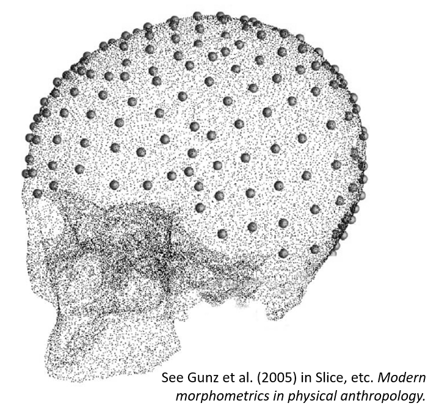  
```

###### Note: resampling methods required for significance testing as $\small{p>>n}$

# Combining Points, Curves, and Surfaces
- Landmarks and semilandmarks can all be combined
    - Digitize points
    - Digitize curve landmarks
    - Digitize surface landmarks

- Define tangent directions and generate **U**
- **GPA + Sliding**

```{r, echo = FALSE, out.width="50%"}
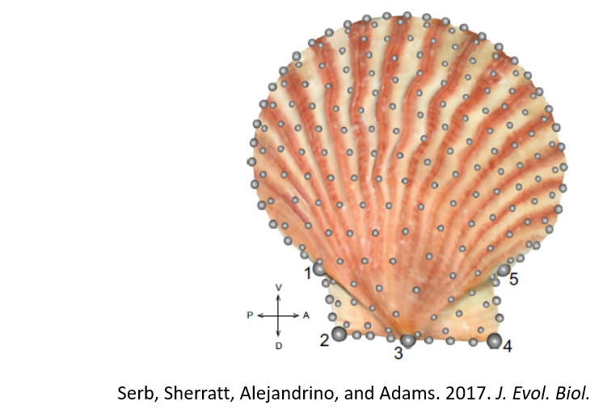  
```

# Complications: Shape Variables and Dimensionality
- Sliding procedure results in redundant shape dimensions
    - Minimum: ~1 df lost per 2D/3D curve semilandmark; and ~2 df lost per 3D surface semilandmark (e.g., ~ $\small{2p-4-m}$ shape variables in 2D for $\small{m}$ = # semilandmarks)
    - However, usually many more dimensions lost, because adjacent semilandmarks encode redundant shape information

- Causes *MAJOR* issues for statistical hypothesis testing using Procrustes residuals

. . . 

- Solutions: 
    - 1: PCA to ‘spin out’ redundant dimensions (remove dimensions with 0.0% variance)
    - 2: Use generalized inverses in computations
    - 3: **Use resampling procedures (RRPP) for significance testing** 
    
###### Note: #3 also required when # shape variables exceeds # specimens

# Semilandmarks: Snake Example

- Examined head shape in snakes (83 species)
- Focused on aquatic species in different families
- Is there evidence of head shape convergence? 

```{r, echo = FALSE, out.width="100%"}
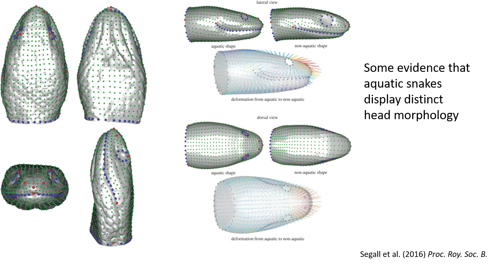  
```

# Semilandmarks: *Homo* Example

- Examined 'Zuttiyeh’ fossil morphology as compared to other early hominids


```{r, echo = FALSE, out.width="100%"}
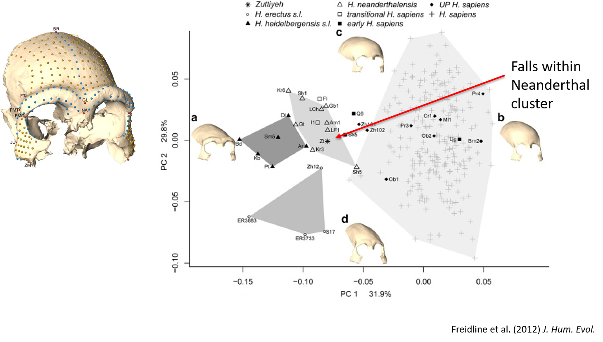  
```

# Semilandmarks: Scallop Example

- Scallop species display differing life habits
- What patterns are observed at the macroevolutionary level?

```{r, echo = FALSE, out.width="100%"}
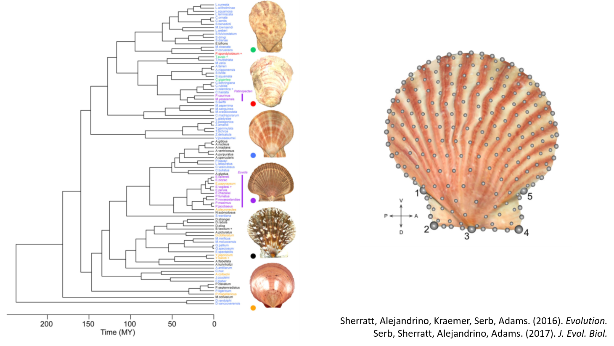  
```

# Semilandmarks: Scallop Example (Cont.)

- Recessors display unique morphology and directional evolution

```{r, echo = FALSE, out.width="100%"}
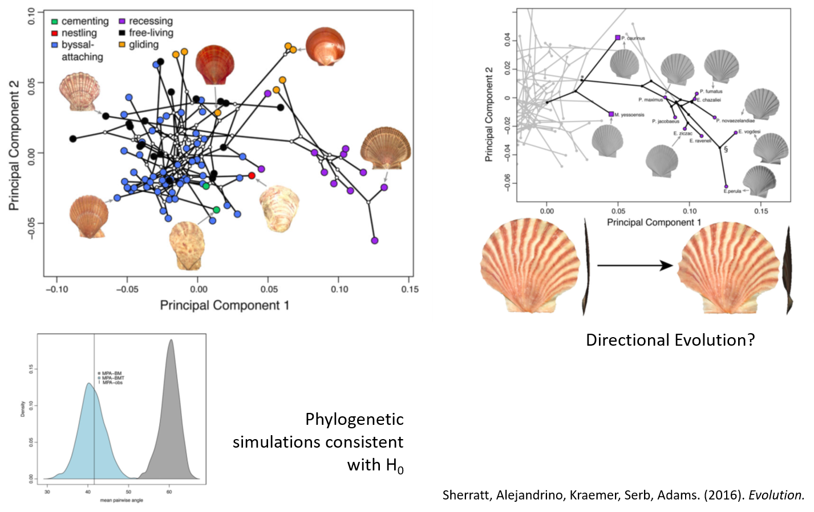  
```

# Semilandmarks: Scallop Example (Cont.)

- Gliders occupy morphological convergence

```{r, echo = FALSE, out.width="100%"}
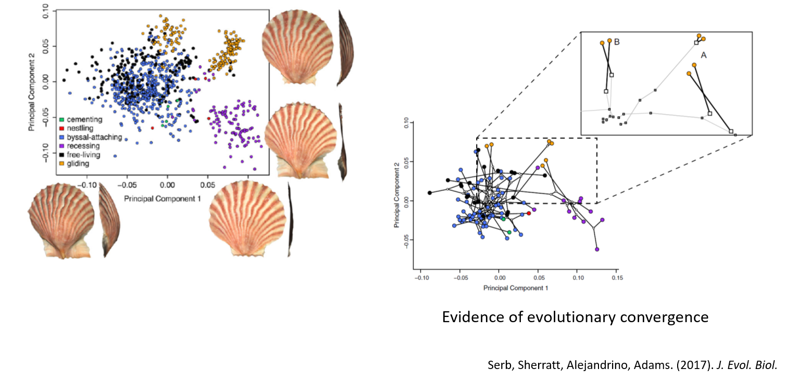  
```

# The Procrustes Paradigm

- With landmarks and semilandmarks we arrive at a general solution for quantifying morphology
- Quantitative information representing:
    - Discrete anatomical points
    - Curves (outlines) of structures
    - Surfaces of structures
- **Can all be combined in a single analysis of shape variation**

```{r, echo = FALSE, out.width="50%"}
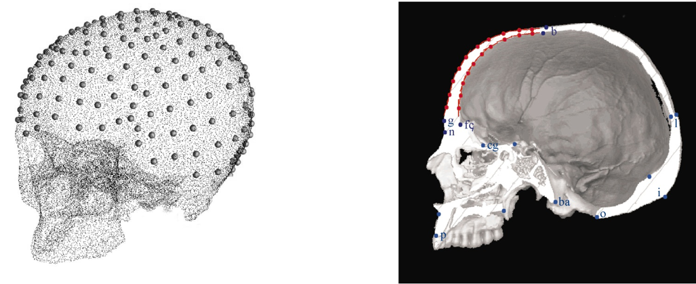  
```


