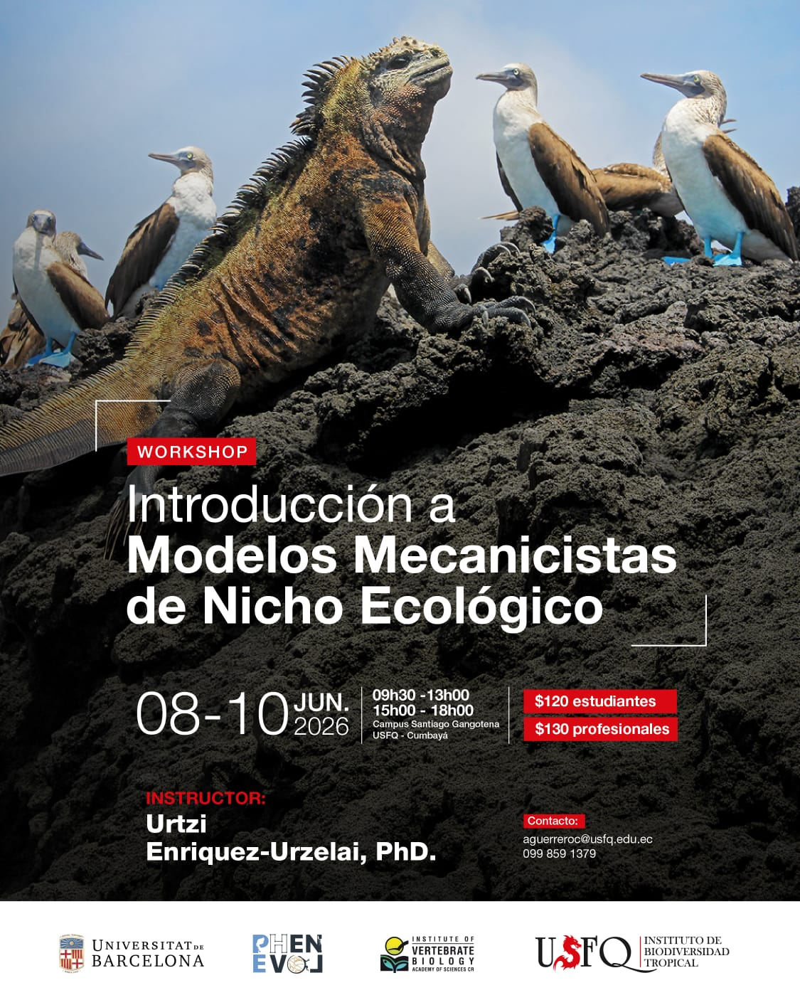

  
Mechanistic ecological niche models integrate morphological, physiological and behavioural traits of organisms to predict their potential distribution and/or biological rates (e.g. rates of heat exchange and water loss) in space and time. Unlike correlative (i.e. statistical) approaches, they allow estimation of a species’ fundamental niche by linking its functional traits to local environmental conditions —such as air temperature, wind speed or radiation— through explicit mechanistic processes. This makes it possible to project the niche onto the landscape and infer the potential distribution of a species even under conditions with no analogue in the present, such as those projected under different climate change scenarios.

The aim of this course is to provide participants with a solid grounding in the theoretical and practical foundations of this approach. To this end, the course covers biophysical ecology methods for estimating microclimatic conditions and simulating the thermal and water balance of organisms with their environment. We will also briefly introduce Dynamic Energy Budget (DEB) theory, which allows simulation of, for example, growth and reproduction of organisms. Although the theoretical part will cover both endotherms and ectotherms, the practical sessions will focus on ectotherm animals.

Particular attention will be paid to the implementation of these models in R, so a basic knowledge of the language is recommended. 

\
\

#####  Instructor: [Urtzi Enriquez-Urzelai](https://urtzienriquez.github.io/)
###### Institute of Vertebrate Biology, Czech Academy of Sciences, Brno, Czechia

\

{width=60% height=60%}

